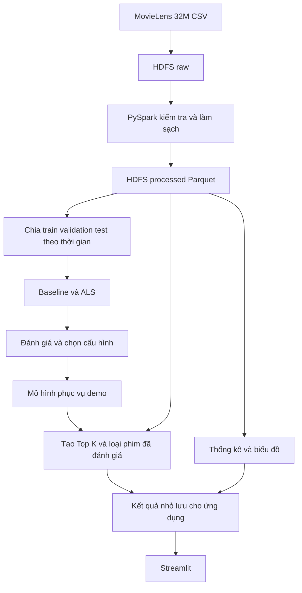

# Hướng dẫn thực hiện đề tài 15 hệ thống gợi ý phim với MovieLens 32M

Tài liệu này hướng dẫn nhóm 2 sinh viên xây dựng hệ thống gợi ý phim cho môn **Nhập môn Big Data**, từ chuẩn bị dữ liệu đến thực nghiệm, demo và hoàn thiện hồ sơ nộp bài. Phương án triển khai là **HDFS + PySpark + Spark MLlib ALS + Streamlit**.

Tài liệu được xây dựng từ [Hướng dẫn đồ án Nhập môn Big Data HUIT](<D:/Học tập/bigdata/Huong_dan_do_an_Nhap_mon_Big_Data_HUIT.docx>), đặc biệt là đề tài số 15 và các mục yêu cầu chung, sản phẩm, cấu trúc báo cáo. Những lựa chọn về phiên bản, cấu hình máy, lịch làm việc và tham số dưới đây là **đề xuất triển khai**, không phải quy định bổ sung của giảng viên.

**Kết quả cần hướng tới:** nhập một `userId` đã có trong mô hình, hệ thống trả về Top 10 phim chưa được người dùng đó đánh giá, kèm tên phim, thể loại và điểm dự đoán. Nhóm có số liệu thực nghiệm để so sánh ALS với phương pháp đơn giản, cùng bằng chứng Spark đã xử lý dữ liệu trên HDFS.

## Mục lục

1. [Yêu cầu môn học và phạm vi đề tài](#1-yêu-cầu-môn-học-và-phạm-vi-đề-tài)
2. [Hiểu bộ dữ liệu MovieLens 32M](#2-hiểu-bộ-dữ-liệu-movielens-32m)
3. [Kiến trúc hệ thống](#3-kiến-trúc-hệ-thống)
4. [Chuẩn bị môi trường](#4-chuẩn-bị-môi-trường)
5. [Tổ chức thư mục và dữ liệu đầu ra](#5-tổ-chức-thư-mục-và-dữ-liệu-đầu-ra)
6. [Nạp dữ liệu và tiền xử lý](#6-nạp-dữ-liệu-và-tiền-xử-lý)
7. [Khảo sát và trực quan hóa dữ liệu](#7-khảo-sát-và-trực-quan-hóa-dữ-liệu)
8. [Chia dữ liệu và ngăn rò rỉ thông tin](#8-chia-dữ-liệu-và-ngăn-rò-rỉ-thông-tin)
9. [Xây dựng phương pháp so sánh và mô hình ALS](#9-xây-dựng-phương-pháp-so-sánh-và-mô-hình-als)
10. [Đánh giá chất lượng gợi ý](#10-đánh-giá-chất-lượng-gợi-ý)
11. [Tạo danh sách gợi ý và giao diện demo](#11-tạo-danh-sách-gợi-ý-và-giao-diện-demo)
12. [Thực nghiệm khả năng xử lý dữ liệu lớn](#12-thực-nghiệm-khả-năng-xử-lý-dữ-liệu-lớn)
13. [Thứ tự xây dựng và chạy chương trình](#13-thứ-tự-xây-dựng-và-chạy-chương-trình)
14. [Kế hoạch và phân công nhóm](#14-kế-hoạch-và-phân-công-nhóm)
15. [Dàn ý báo cáo Word](#15-dàn-ý-báo-cáo-word)
16. [Slide và kịch bản demo](#16-slide-và-kịch-bản-demo)
17. [Lỗi thường gặp](#17-lỗi-thường-gặp)
18. [Checklist trước khi nộp](#18-checklist-trước-khi-nộp)
19. [Tài liệu tham khảo](#19-tài-liệu-tham-khảo)

## 1 Yêu cầu môn học và phạm vi đề tài

### 1.1 Những yêu cầu lấy từ file hướng dẫn

File gốc quy định mỗi nhóm gồm **2 sinh viên** và mỗi đề tài sử dụng **ít nhất một công nghệ Big Data hoặc công nghệ lưu trữ, xử lý phân tán**. Đề tài số 15 gợi ý MovieLens, HDFS, Spark MLlib, lọc cộng tác ALS, các độ đo RMSE, MAE, Precision@K hoặc Recall@K và giao diện minh họa.

File cũng nói rõ công nghệ, thuật toán và dữ liệu trong danh sách đề tài là gợi ý có thể điều chỉnh nếu vẫn đáp ứng yêu cầu môn học. Hướng dẫn này chọn HDFS và Spark để bám sát phương án gợi ý của đề tài 15.

| Nội dung bắt buộc trong file gốc | Cách thực hiện trong đề tài này | Bằng chứng cần có |
| --- | --- | --- |
| Xác định bài toán | Gợi ý phim từ lịch sử chấm điểm | Mục tiêu, đầu vào, đầu ra, phạm vi |
| Dữ liệu | MovieLens 32M | Nguồn, quy mô, schema, đặc điểm dữ liệu |
| Tiền xử lý | Kiểm tra thiếu, trùng, sai kiểu, rating không hợp lệ | Bảng số dòng trước và sau xử lý |
| Lưu trữ và xử lý | CSV gốc và Parquet trên HDFS; xử lý bằng Spark | Sơ đồ kiến trúc, lệnh HDFS, Spark UI |
| Mô hình hoặc kỹ thuật | Lọc cộng tác bằng ALS | Giải thích thuật toán, mã huấn luyện, tham số |
| Thực nghiệm | Chạy xuyên suốt từ dữ liệu đến gợi ý | Môi trường, lệnh chạy, log, đầu ra |
| Đánh giá kết quả | RMSE, MAE và chất lượng Top K | Bảng so sánh, diễn giải, hạn chế |
| Trực quan hóa hoặc demo | Biểu đồ dữ liệu và giao diện Streamlit | Ảnh giao diện, thao tác demo |

### 1.2 Tên và phát biểu bài toán

**Tên đề xuất:** Xây dựng hệ thống gợi ý phim sử dụng Apache Spark và thuật toán ALS trên bộ dữ liệu MovieLens 32M.

- **Bối cảnh:** danh mục phim lớn khiến người dùng khó chọn phim phù hợp.
- **Đầu vào:** lịch sử `(userId, movieId, rating, timestamp)` và thông tin phim.
- **Đầu ra:** danh sách K phim được xếp hạng cho một người dùng.
- **Giá trị:** hỗ trợ khám phá phim dựa trên các mẫu sở thích trong dữ liệu đánh giá.
- **Giới hạn:** MovieLens ghi nhận chấm điểm; không thể xem đó là toàn bộ lịch sử xem phim. Trong chương trình nên dùng nhãn “đã đánh giá” và “chưa đánh giá”.

### 1.3 Phạm vi nên hoàn thành trước

1. Lưu và đọc MovieLens 32M qua HDFS.
2. Làm sạch và tạo các bảng Parquet bằng Spark DataFrame.
3. Có thống kê dữ liệu, mô hình ALS và phương pháp so sánh đơn giản.
4. Có train, validation, test tách biệt; lưu kết quả thực nghiệm.
5. Gợi ý Top 10, loại phim đã đánh giá, xử lý người dùng mới bằng phương án dự phòng.
6. Có giao diện, báo cáo, slide và hướng dẫn chạy.

Sau khi hoàn thành các phần này mới cân nhắc gợi ý theo thể loại, kết hợp nội dung, nhiều Spark worker hoặc bổ sung metadata. Kafka, xử lý streaming và deep learning không cần thiết cho quy trình batch của đề tài này.

## 2 Hiểu bộ dữ liệu MovieLens 32M

### 2.1 Nguồn và quy mô

Tải từ [trang MovieLens 32M của GroupLens](https://grouplens.org/datasets/movielens/32m/). Đây là bản benchmark cố định; cần dùng đúng `ml-32m`, tránh thay bằng `ml-latest` trong quá trình làm bài.

| Thông tin | Giá trị do GroupLens công bố |
| --- | --- |
| Số lượt đánh giá | 32.000.204 |
| Số lượt gắn tag | 2.000.072 |
| Số người dùng | 200.948 |
| Số phim trong bộ dữ liệu | 87.585 |
| Khoảng thời gian dữ liệu | 09/01/1995 đến 12/10/2023 |
| Thang rating | 0,5 đến 5,0; bước 0,5 |
| Tệp tải xuống | `ml-32m.zip`, khoảng 239 MB theo trang tải |

Các số lượng chính xác và cấu trúc tệp được mô tả trong [README MovieLens 32M](https://files.grouplens.org/datasets/movielens/ml-32m-README.html). Khi chạy dự án, đo lại số dòng và dung lượng thực tế. Dung lượng ZIP không phải dung lượng sau giải nén hoặc RAM cần cho huấn luyện.

### 2.2 Các tệp sử dụng

| Tệp | Các cột | Vai trò trong dự án |
| --- | --- | --- |
| `ratings.csv` | `userId,movieId,rating,timestamp` | Huấn luyện và đánh giá |
| `movies.csv` | `movieId,title,genres` | Hiển thị, phân tích thể loại |
| `tags.csv` | `userId,movieId,tag,timestamp` | Khảo sát bổ sung; mở rộng nội dung |
| `links.csv` | `movieId,imdbId,tmdbId` | Liên kết metadata ngoài nếu cần |

`timestamp` tính theo giây UTC; các tệp dùng UTF-8. `genres` chứa các thể loại phân cách bằng `|`. Dataset không có thông tin nhân khẩu học. Xem [đặc tả dữ liệu của GroupLens](https://files.grouplens.org/datasets/movielens/ml-32m-README.html).

**Quyết định triển khai:** phiên bản đầu chỉ dùng `ratings.csv` và `movies.csv`. Giữ nguyên `tags.csv`, `links.csv` trong lớp dữ liệu gốc để có thể bổ sung sau. Hai tệp này không phải đầu vào bắt buộc của ALS.

### 2.3 Cách giải thích tính chất Big Data

- **Volume:** 32 triệu đánh giá tạo ra chi phí đáng kể khi đọc, gom nhóm, chia dữ liệu và lặp huấn luyện. Đo dung lượng CSV, Parquet và thời gian từng công đoạn để minh họa.
- **Variety:** dữ liệu số, văn bản tiêu đề, danh sách thể loại và tag có cách xử lý khác nhau.
- **Velocity:** phiên bản này là dữ liệu tĩnh. Có thể thảo luận việc đánh giá mới phát sinh trong ứng dụng thực tế, nhưng thực nghiệm hiện tại là xử lý theo lô.
- **Veracity:** kiểm tra chất lượng bản ghi và sai lệch trong dữ liệu đánh giá tự nguyện.
- **Value:** chuyển lịch sử đánh giá thành danh sách phim có thể giới thiệu cho người dùng.

Ma trận người dùng và phim có nhiều ô chưa quan sát. **Không tạo ma trận đầy đủ bằng Pandas hoặc NumPy và không điền rating thiếu bằng 0.** Lưu mỗi đánh giá thành một dòng và để ALS học từ các đánh giá đã quan sát.

## 3 Kiến trúc hệ thống



Mũi tên từ dữ liệu đã xử lý đến bước gợi ý biểu diễn việc lấy thông tin phim và lịch sử phù hợp với phiên bản mô hình. Khi đánh giá offline, chỉ dùng lịch sử trước mốc đánh giá để loại phim đã biết; xem mục 8 và 10.

| Thành phần | Nhiệm vụ | Lý do lựa chọn |
| --- | --- | --- |
| HDFS | Lưu dữ liệu gốc, Parquet, checkpoint và mô hình | Thể hiện công nghệ lưu trữ trong đề tài |
| Spark DataFrame và SQL | Đọc, kiểm tra, join, thống kê, chia dữ liệu | Xử lý dữ liệu theo các partition |
| `pyspark.ml.recommendation.ALS` | Huấn luyện lọc cộng tác | Phù hợp dữ liệu rating và tích hợp với Spark |
| Parquet | Định dạng dữ liệu đã xử lý | Thuận tiện lưu schema và đọc các cột cần thiết |
| Streamlit | Hiển thị thống kê và gợi ý | Giao diện nhỏ, phù hợp demo môn học |
| Git | Quản lý mã và đóng góp | Dễ tái hiện thay đổi của từng thành viên |

**Phân biệt hai cách triển khai:**

- **Máy cá nhân:** HDFS một NameNode và một DataNode, Spark `local[4]`. Đây là HDFS ở chế độ giả phân tán và Spark chạy song song trên một máy; báo cáo đúng cấu hình này.
- **Mở rộng:** Spark Standalone hoặc môi trường của phòng máy với nhiều worker; nếu nhiều tiến trình vẫn cùng một laptop, không gọi đó là thực nghiệm trên nhiều máy vật lý.

Không cần triển khai YARN để dùng Spark local đọc HDFS trong phương án đầu tiên.

## 4 Chuẩn bị môi trường

### 4.1 Cấu hình tham khảo

| Tài nguyên | Cách sử dụng đề xuất |
| --- | --- |
| Máy 8 GB RAM | Phát triển trên tập con; ưu tiên máy phòng lab cho lượt huấn luyện lớn |
| Máy 16 GB RAM | Bắt đầu Spark với 4 GB heap, tăng sau khi đo; chạy lần lượt các thí nghiệm |
| Máy từ 32 GB RAM | Có thêm dư địa cho toàn bộ train và các cấu hình ALS |
| CPU | Bắt đầu 2 hoặc 4 luồng; đo trước khi tăng |
| Ổ đĩa | Nên có ít nhất 30 GB trống cho dữ liệu, môi trường, shuffle, checkpoint và mô hình |

Đây là ngân sách khởi đầu, không bảo đảm thời gian chạy hay khả năng vừa bộ nhớ. WSL, Windows, HDFS và Python cũng dùng RAM ngoài heap của Spark. Không cấp toàn bộ RAM của máy cho Spark.

### 4.2 Bộ phiên bản dùng trong các ví dụ

- Ubuntu 22.04 trong WSL2 trên Windows, hoặc một máy Ubuntu tương đương.
- Python 3.10 và OpenJDK 11.
- Hadoop 3.3.6.
- PySpark 3.5.7.
- NumPy 1.26.4; Streamlit và thư viện vẽ biểu đồ được khóa phiên bản sau khi kiểm tra môi trường.

Đây là bộ phiên bản cố định để viết hướng dẫn. Nếu dùng môi trường giảng viên cấp, ưu tiên phiên bản tại đó và cập nhật hướng dẫn chạy. Kiểm tra tương thích theo [cài đặt PySpark 3.5.7](https://spark.apache.org/docs/3.5.7/api/python/getting_started/install.html) và [Java cho Hadoop](https://cwiki.apache.org/confluence/spaces/HADOOP/pages/100827883/Hadoop+Java+Versions).

### 4.3 Cài WSL và thư viện Python

Nếu Windows chưa có WSL, mở PowerShell với quyền quản trị và thực hiện theo [Microsoft Learn về WSL](https://learn.microsoft.com/en-us/windows/wsl/install):

```powershell
wsl --install -d Ubuntu-22.04
```

Khởi động lại nếu được yêu cầu, mở Ubuntu và tạo tài khoản Linux. **Các lệnh `bash` còn lại trong tài liệu chạy trong Ubuntu, không chạy trực tiếp trong PowerShell.** Nên đặt dữ liệu làm việc trong filesystem Linux để thuận tiện cho Hadoop.

```bash
sudo apt update
sudo apt install -y openjdk-11-jdk python3-venv python3-pip curl unzip

mkdir -p "$HOME/movielens-lab"
cd "$HOME/movielens-lab"
python3 -m venv .venv
source .venv/bin/activate
python -m pip install --upgrade pip
python -m pip install pyspark==3.5.7 numpy==1.26.4 streamlit pandas plotly
python -m pip freeze > requirements.lock.txt

java -version
python --version
spark-submit --version
```

Ghi lại phiên bản Java và toàn bộ Python package trong báo cáo. Hai thành viên dùng cùng `requirements.lock.txt`; không thay phiên bản thư viện giữa các lượt so sánh.

### 4.4 Thiết lập HDFS một máy

Nếu đã có HDFS của môn học, dùng địa chỉ NameNode và tài khoản được cấp. Nếu chưa có, có thể thiết lập môi trường thực hành riêng theo [hướng dẫn một node của Apache Hadoop](https://hadoop.apache.org/docs/r3.3.6/hadoop-project-dist/hadoop-common/SingleCluster.html).

Ví dụ cài Hadoop trong thư mục người dùng:

```bash
mkdir -p "$HOME/tools"
cd "$HOME/tools"
curl -fL --retry 3 -o hadoop-3.3.6.tar.gz \
  https://archive.apache.org/dist/hadoop/common/hadoop-3.3.6/hadoop-3.3.6.tar.gz
tar -xzf hadoop-3.3.6.tar.gz

export JAVA_HOME="$(dirname "$(dirname "$(readlink -f "$(command -v javac)")")")"
export HADOOP_HOME="$HOME/tools/hadoop-3.3.6"
export HADOOP_CONF_DIR="$HADOOP_HOME/etc/hadoop"
export PATH="$HADOOP_HOME/bin:$PATH"
export MOVIE_LAB="$HOME/movielens-lab"
mkdir -p "$MOVIE_LAB/hdfs/name" "$MOVIE_LAB/hdfs/data"
```

Lưu các dòng `export` vào một tệp cấu hình riêng của dự án, ví dụ `env.sh`, rồi `source env.sh` ở mỗi terminal mới. Biến `JAVA_HOME` phải trỏ đến JDK 11 đã chọn; kiểm tra bằng `"$JAVA_HOME/bin/java" -version`.

Trong **bản Hadoop vừa cài riêng cho dự án**, cấu hình hai tệp sau. Heredoc không đặt dấu nháy ở `XML` để Bash thay giá trị `MOVIE_LAB` thành đường dẫn thật:

```bash
cat > "$HADOOP_CONF_DIR/core-site.xml" <<XML
<configuration>
  <property>
    <name>fs.defaultFS</name>
    <value>hdfs://localhost:9000</value>
  </property>
</configuration>
XML

cat > "$HADOOP_CONF_DIR/hdfs-site.xml" <<XML
<configuration>
  <property>
    <name>dfs.replication</name>
    <value>1</value>
  </property>
  <property>
    <name>dfs.namenode.name.dir</name>
    <value>file://$MOVIE_LAB/hdfs/name</value>
  </property>
  <property>
    <name>dfs.datanode.data.dir</name>
    <value>file://$MOVIE_LAB/hdfs/data</value>
  </property>
</configuration>
XML
```

**Chỉ format khi tạo HDFS mới và thư mục NameNode chưa chứa dữ liệu cần giữ.** Không format lại để khởi động những lần sau.

```bash
# Chỉ chạy một lần khi khởi tạo mới
hdfs namenode -format

# Chạy mỗi lần cần khởi động HDFS đã có
hdfs --daemon start namenode
hdfs --daemon start datanode
hdfs dfsadmin -report
```

Cách khởi động daemon trực tiếp phù hợp với bản thực hành một máy; không cần cấu hình SSH cho lệnh `start-dfs.sh`. Tham khảo [các lệnh HDFS](https://hadoop.apache.org/docs/r3.3.6/hadoop-project-dist/hadoop-hdfs/HDFSCommands.html).

Kiểm tra có **1 Live DataNode** và mở [NameNode UI trên máy thực hành](http://localhost:9870). Nếu WSL không chuyển tiếp được localhost sang trình duyệt Windows, lấy địa chỉ WSL bằng `hostname -I` để truy cập. Khi kết thúc buổi làm việc, dừng DataNode rồi NameNode bằng `hdfs --daemon stop datanode` và `hdfs --daemon stop namenode`.

### 4.5 Tải MovieLens và đưa lên HDFS

```bash
cd "$MOVIE_LAB"
source .venv/bin/activate
mkdir -p data/raw
curl -fL --retry 3 -o data/raw/ml-32m.zip \
  https://files.grouplens.org/datasets/movielens/ml-32m.zip
unzip data/raw/ml-32m.zip -d data/raw

md5sum data/raw/ml-32m/*.csv
hdfs dfs -mkdir -p /movielens/raw /movielens/processed /movielens/models
hdfs dfs -mkdir -p /movielens/splits /movielens/checkpoints /movielens/results
hdfs dfs -put data/raw/ml-32m/ratings.csv /movielens/raw/
hdfs dfs -put data/raw/ml-32m/movies.csv /movielens/raw/
hdfs dfs -put data/raw/ml-32m/tags.csv /movielens/raw/
hdfs dfs -put data/raw/ml-32m/links.csv /movielens/raw/
hdfs dfs -ls -h /movielens/raw
hdfs dfs -du -h /movielens/raw
```

Đối chiếu checksum với [README của bộ dữ liệu](https://files.grouplens.org/datasets/movielens/ml-32m-README.html). Lần chạy lại, kiểm tra tệp đã tồn tại trước khi nạp; không cần ghi lại raw nếu dữ liệu không thay đổi.

**Điều kiện hoàn thành bước môi trường:** Spark đọc được `hdfs://localhost:9000/movielens/raw/ratings.csv`, đếm được dữ liệu và ghi được một bảng Parquet thử nghiệm. Cài `pyspark` bằng pip không tự tạo NameNode hoặc DataNode.

## 5 Tổ chức thư mục và dữ liệu đầu ra

Đây là cấu trúc **cần xây dựng trong dự án**, chưa phải các tệp mã nguồn đi kèm tài liệu hướng dẫn này:

```text
movielens-lab/
├── README.md
├── requirements.lock.txt
├── env.sh
├── configs/
│   └── experiment.json
├── data/raw/                    # Bản tải về, bỏ qua trong Git
├── src/
│   ├── 01_etl.py                # Kiểm tra CSV và ghi Parquet
│   ├── 02_eda.py                # Thống kê phục vụ biểu đồ
│   ├── 03_split.py              # Chia và lưu train, validation, test
│   ├── 04_train.py              # Baseline, thử tham số, lưu mô hình
│   ├── 05_evaluate.py           # Đánh giá test sau khi khóa cấu hình
│   └── 06_export_demo.py        # Kết quả nhỏ dùng cho giao diện
├── app/
│   └── streamlit_app.py
├── artifacts/
│   ├── data_quality.json
│   ├── split_manifest.json
│   ├── experiments.csv
│   ├── test_metrics.json
│   ├── figures/
│   └── demo/                   # Metadata và gợi ý đã xuất
├── logs/
└── docs/
    ├── bao_cao.docx
    ├── slide_thuyet_trinh.pptx
    └── phan_cong_cong_viec.md
```

HDFS lưu các lớp dữ liệu:

```text
/movielens/raw/                  CSV giữ nguyên
/movielens/processed/ratings/    Rating hợp lệ dưới dạng Parquet
/movielens/processed/movies/     Metadata đã xử lý
/movielens/quarantine/           Bản ghi cần kiểm tra nếu có
/movielens/splits/<split_id>/    train, validation, test
/movielens/models/<run_id>/      Mô hình và cấu hình của từng lần chạy
/movielens/checkpoints/<run_id>/ Checkpoint ALS
/movielens/results/<run_id>/     Thống kê và kết quả gợi ý
```

Các tệp `artifacts/*.json` và CSV là bằng chứng thực nghiệm, do chương trình tạo từ kết quả thực tế. Đưa mã, cấu hình và bảng kết quả nhỏ vào Git; dùng `.gitignore` cho `.venv`, dữ liệu lớn, model lớn và thư mục HDFS vật lý.

## 6 Nạp dữ liệu và tiền xử lý

### 6.1 Đọc bằng Spark với schema rõ ràng

Các đoạn Python trong hướng dẫn là **khung mã để triển khai các bước**, chưa phải một ứng dụng hoàn chỉnh. Các đoạn liên tiếp có thể dùng chung biến trong notebook; khi tách thành script, mỗi script tạo SparkSession và đọc đầu vào đã lưu của bước trước.

```python
from pyspark.sql import SparkSession, functions as F, types as T

spark = (
    SparkSession.builder
    .appName("MovieLens32M-ETL")
    .config("spark.sql.session.timeZone", "UTC")
    .config("spark.sql.shuffle.partitions", "64")
    .getOrCreate()
)

base = "hdfs://localhost:9000/movielens"
rating_schema = T.StructType([
    T.StructField("userId", T.IntegerType(), True),
    T.StructField("movieId", T.IntegerType(), True),
    T.StructField("rating", T.FloatType(), True),
    T.StructField("timestamp", T.LongType(), True),
])
movie_schema = "movieId INT, title STRING, genres STRING"

ratings_raw = (
    spark.read.option("header", True).option("mode", "FAILFAST")
    .schema(rating_schema).csv(f"{base}/raw/ratings.csv")
)
movies_raw = (
    spark.read.option("header", True).option("mode", "FAILFAST")
    .option("quote", '"').option("escape", '"')
    .schema(movie_schema).csv(f"{base}/raw/movies.csv")
)
ratings_raw.printSchema()
ratings_raw.show(5, truncate=False)
```

`FAILFAST` giúp phát hiện lỗi parse khi có action thực sự, ví dụ `count()` hoặc ghi tệp. Nếu cần lưu dòng CSV hỏng để kiểm tra, triển khai riêng chế độ `PERMISSIVE` với cột `_corrupt_record`; không âm thầm bỏ qua. Không tách CSV bằng `split(',')` vì tiêu đề có thể chứa dấu phẩy. Xem [cách đọc CSV trong Spark](https://spark.apache.org/docs/3.5.7/sql-data-sources-csv.html).

### 6.2 Quy tắc chất lượng dữ liệu

| Trường hợp | Cách xử lý đề xuất |
| --- | --- |
| Thiếu ID, rating hoặc timestamp | Ghi số lượng và cách ly dòng lỗi |
| Rating ngoài thang hoặc sai bước 0,5 | Cách ly và kiểm tra nguồn |
| ID không hợp lệ, không vừa số nguyên 32 bit | Kiểm tra; ALS yêu cầu ID trong miền số nguyên |
| Timestamp không hợp lệ | Cách ly; kiểm tra min, max và đơn vị giây |
| Dòng trùng hoàn toàn | Giữ một dòng; ghi số dòng bị loại |
| Một cặp user và movie có nhiều đánh giá khác thời điểm | Kiểm tra trước khi chọn chính sách; xem mục 8 |
| Rating tham chiếu phim không có metadata | Báo cáo số lượng; xử lý rõ ràng trước khi join |
| Không có thể loại | Giữ nhóm “Chưa có thể loại”; không tự loại phim |
| Tên phim không trích được năm | Để năm là null; vẫn giữ phim |
| Người dùng hoặc phim có ít rating | Phân tích độ thưa; không coi ít rating là lỗi |

Ví dụ tách dòng hợp lệ và ghi Parquet, áp dụng khi đã kiểm tra khóa `movieId` của bảng phim là duy nhất:

```python
from pyspark import StorageLevel

valid_expr = (
    F.col("userId").isNotNull() & (F.col("userId") > 0)
    & F.col("movieId").isNotNull() & (F.col("movieId") > 0)
    & F.col("rating").isNotNull() & (~F.isnan("rating"))
    & F.col("rating").between(0.5, 5.0)
    & ((F.col("rating") * 2) == F.floor(F.col("rating") * 2))
    & F.col("timestamp").isNotNull() & (F.col("timestamp") > 0)
)
checked = ratings_raw.withColumn("valid", F.coalesce(valid_expr, F.lit(False)))
invalid = checked.filter(~F.col("valid")).drop("valid")
valid = checked.filter("valid").drop("valid")
dedup = valid.dropDuplicates(["userId", "movieId", "rating", "timestamp"])

movie_ids = movies_raw.select("movieId").distinct()
orphans = dedup.join(movie_ids, "movieId", "left_anti")
clean = (
    dedup.join(movie_ids, "movieId", "left_semi")
    .persist(StorageLevel.MEMORY_AND_DISK)
)

n_raw = ratings_raw.count()
n_invalid = invalid.count()
n_valid = valid.count()
n_dedup = dedup.count()
n_orphans = orphans.count()
n_clean = clean.count()

quality = {
    "raw": n_raw,
    "invalid": n_invalid,
    "exact_duplicates_removed": n_valid - n_dedup,
    "orphan_movie_rows": n_orphans,
    "clean": n_clean,
}
assert n_raw == n_invalid + (n_valid - n_dedup) + n_orphans + n_clean
print(quality)

clean.repartition(64).write.mode("errorifexists").parquet(
    f"{base}/processed/ratings"
)
movies_raw.write.mode("errorifexists").parquet(f"{base}/processed/movies")
clean.unpersist()
```

Trong script hoàn chỉnh, ghi `quality` ra `artifacts/data_quality.json`, ghi các dòng cách ly nếu có, kiểm tra min và max thời gian. Trước khi ghi bảng phim, kiểm tra ID thiếu hoặc trùng và thống kê tên, thể loại thiếu. Nếu có lỗi thì xử lý theo bảng quy tắc; ví dụ trên không thay thế các bước kiểm tra đó.

**Mốc hoàn thành:** có bảng đối soát số dòng, schema rõ ràng và Parquet đọc lại được. Số `64` là điểm bắt đầu để thử partition, cần điều chỉnh theo máy và kích thước tệp. Khi chạy lại, dùng thư mục phiên bản mới hoặc chủ động quyết định thay đầu ra cũ.

## 7 Khảo sát và trực quan hóa dữ liệu

Thực hiện EDA, tức khảo sát dữ liệu trước khi xây dựng mô hình, bằng các phép tổng hợp Spark. Chỉ đưa bảng tổng hợp nhỏ về Pandas để vẽ.

| Câu hỏi | Phép tính | Biểu đồ đề xuất |
| --- | --- | --- |
| Người dùng thường cho mấy sao? | Số rating theo từng mức 0,5 sao | Biểu đồ cột |
| Phim nào được đánh giá nhiều? | Đếm theo `movieId`, lấy Top 20 | Thanh ngang |
| Mỗi người dùng đánh giá bao nhiêu phim? | Đếm theo `userId`, chia khoảng | Histogram, cân nhắc trục log |
| Có nhiều phim rất ít đánh giá không? | Phân phối số rating theo phim | Histogram hoặc đường tích lũy |
| Đánh giá thay đổi theo thời gian thế nào? | Đếm theo năm hoặc tháng UTC | Biểu đồ đường |
| Các thể loại xuất hiện ra sao? | Tách `genres`, đếm phim hoặc rating | Biểu đồ cột, ghi rõ đơn vị |

Một phim có nhiều thể loại sẽ được tính vào nhiều nhóm khi dùng `explode`. Tổng số lượt theo thể loại có thể vượt số rating gốc; cần giải thích điều này trong báo cáo.

Ví dụ lấy bảng nhỏ:

```python
ratings = spark.read.parquet(f"{base}/processed/ratings")
rating_distribution = (
    ratings.groupBy("rating").count().orderBy("rating").toPandas()
)
top_movies = (
    ratings.groupBy("movieId").count()
    .orderBy(F.desc("count"), F.asc("movieId")).limit(20)
    .join(movies_raw, "movieId")
    .orderBy(F.desc("count"), F.asc("movieId"))
    .toPandas()
)
```

Phân biệt **phổ biến** theo số lượt đánh giá và **điểm trung bình cao**. Phim có một đánh giá 5 sao chưa đủ để kết luận tốt hơn phim có nhiều đánh giá. Nếu đặt ngưỡng số rating tối thiểu cho bảng xếp hạng, công bố ngưỡng đó.

EDA toàn bộ dữ liệu chỉ phục vụ mô tả. Mọi thống kê dùng để chọn phim gợi ý, tính baseline hoặc quyết định tham số phải lấy từ phần dữ liệu huấn luyện tương ứng.

## 8 Chia dữ liệu và ngăn rò rỉ thông tin

### 8.1 Chọn cách chia chính

Dùng **hai mốc thời gian chung cho toàn bộ dữ liệu**:

- **Train:** các đánh giá sớm nhất, mục tiêu khoảng 80% số dòng.
- **Validation:** giai đoạn tiếp theo, khoảng 10%, dùng chọn tham số.
- **Test:** giai đoạn cuối, khoảng 10%, dùng báo cáo sau khi đã khóa cấu hình.

Có thể tìm mốc bằng phân vị của `timestamp`, rồi lưu hai mốc đó để tất cả mô hình dùng lại. Các dòng cùng timestamp ở ranh giới được giữ cùng phía, vì vậy tỷ lệ thực tế không nhất thiết đúng 80/10/10.

**Vì sao chọn thời gian chung:** mô phỏng tình huống học từ các đánh giá trước một thời điểm để gợi ý cho giai đoạn sau. Cách chia này cũng làm xuất hiện người dùng hoặc phim mới; cần báo cáo tỷ lệ cold start ở mục 10.

Chia ngẫu nhiên có thể dùng như thí nghiệm phụ nếu ghi rõ giao thức. Không so trực tiếp một kết quả random split với một kết quả temporal split rồi quy chênh lệch hoàn toàn cho thuật toán.

### 8.2 Xử lý cặp user và movie lặp lại

Sau khi bỏ dòng trùng hoàn toàn, kiểm tra còn nhiều dòng cho cùng `(userId, movieId)` hay không. Nếu có, một chính sách đơn giản cho bài toán gợi ý phim mới là giữ **đánh giá đầu tiên** của mỗi cặp theo thời gian; các dòng cùng thời điểm nhưng khác rating phải được kiểm tra riêng.

Không mặc định giữ đánh giá cuối cùng trên toàn bộ dữ liệu trước khi chia: một đánh giá cập nhật ở tương lai có thể làm mất hoặc thay đổi thông tin lịch sử. Ghi số dòng bị ảnh hưởng và chính sách xử lý vào báo cáo.

### 8.3 Ví dụ chia và lưu các tập

Đoạn mã dưới đây dừng nếu cặp user và movie vẫn chưa duy nhất, để nhóm xử lý theo chính sách đã chọn trước khi chạy tiếp:

```python
ratings = spark.read.parquet(f"{base}/processed/ratings")
duplicate_pairs = (
    ratings.groupBy("userId", "movieId").count().filter("count > 1")
)
assert duplicate_pairs.limit(1).count() == 0, "Cần xử lý cặp đánh giá lặp"

t1, t2 = [
    int(value) for value in ratings.approxQuantile(
        "timestamp", [0.8, 0.9], 0.001
    )
]
assert t1 < t2, "Cần kiểm tra lại mốc thời gian"

train = ratings.filter(F.col("timestamp") <= t1)
validation = ratings.filter(
    (F.col("timestamp") > t1) & (F.col("timestamp") <= t2)
)
test = ratings.filter(F.col("timestamp") > t2)

split_id = "time_v1"
for name, frame in [
    ("train", train), ("validation", validation), ("test", test)
]:
    frame.write.mode("errorifexists").parquet(f"{base}/splits/{split_id}/{name}")
```

Ghi `split_manifest.json` gồm: `split_id`, phiên bản dataset, quy tắc làm sạch, `t1`, `t2`, ngày UTC tương ứng, số dòng từng tập, số user và movie từng tập. Kiểm tra tổng số dòng bằng số dòng đầu vào của bước chia; các tập không giao nhau.

### 8.4 Phân biệt mô hình thử nghiệm và mô hình demo

| Giai đoạn | Dữ liệu fit mô hình và baseline | Dữ liệu đánh giá | Lịch sử dùng loại phim đã biết |
| --- | --- | --- | --- |
| Thử tham số | Train | Validation | Train |
| Báo cáo cuối | Train + validation, với tham số đã chọn | Test | Train + validation |
| Mô hình demo tùy chọn sau thực nghiệm | Toàn bộ dữ liệu hợp lệ | Không dùng lại test để công bố chất lượng mô hình này | Toàn bộ lịch sử hợp lệ |

Mô hình huấn luyện trên toàn bộ dữ liệu có thể phục vụ demo sau khi đã chốt thực nghiệm, nhưng không được gắn kết quả test của mô hình trước đó như thể đó là phép đo trực tiếp cho mô hình mới. Lưu `model_version`, `split_id` và khoảng dữ liệu fit của từng mô hình.

## 9 Xây dựng phương pháp so sánh và mô hình ALS

### 9.1 Các phương pháp so sánh đơn giản

Một đồ án có kết quả ALS sẽ dễ đánh giá hơn nếu có các mốc so sánh:

| Phương pháp | Quy tắc | Dùng đánh giá |
| --- | --- | --- |
| Global mean | Dự đoán mọi rating bằng trung bình của tập fit | RMSE, MAE |
| Item mean | Trung bình theo phim; phim mới dùng global mean | RMSE, MAE |
| Popularity | Xếp theo số rating từ 4 sao trở lên trong tập fit | Precision@K, Recall@K |
| ALS | Học vector người dùng và phim | Cả dự đoán rating và Top K |

Với Popularity, sắp giảm dần theo số lượt từ 4 sao, tiếp theo tổng số lượt đánh giá, cuối cùng tăng dần `movieId` để phá hòa ổn định. Gán số lượt bằng 0 cho phim trong tập ứng viên chưa có rating tích cực. Loại phim đã đánh giá của từng người dùng bằng cùng quy tắc dùng cho ALS.

Ví dụ tạo thống kê từ train:

```python
global_mean = train.agg(F.avg("rating").alias("mean")).first()["mean"]
item_stats = train.groupBy("movieId").agg(
    F.avg("rating").alias("item_mean"),
    F.count("*").alias("rating_count"),
    F.sum(F.when(F.col("rating") >= 4.0, 1).otherwise(0)).alias("positive_count"),
)
```

### 9.2 Giải thích ALS trong báo cáo

Lọc cộng tác tận dụng các mẫu chấm điểm giữa nhiều người dùng. ALS biểu diễn mỗi người dùng bằng vector `p_u`, mỗi phim bằng vector `q_i`, rồi dự đoán:

```text
rating_dự_đoán(u, i) = tích_vô_hướng(p_u, q_i)
```

`rank` là số chiều vector. Thuật toán luân phiên cập nhật phía người dùng và phía phim; `regParam` điều chỉnh mức phạt để hạn chế học quá sát dữ liệu train. Spark sử dụng biến thể ALS-WR có điều chỉnh regularization theo số đánh giá. Xem [lọc cộng tác trong Spark](https://spark.apache.org/docs/3.5.7/ml-collaborative-filtering.html).

Vì MovieLens có rating trực tiếp, đặt **`implicitPrefs=False`**. Không chuyển các ô thiếu thành rating 0; các ô đó là chưa quan sát. Thể loại và tiêu đề dùng cho phân tích, hiển thị; ALS cơ bản không tự dùng hai trường này để học.

### 9.3 Cấu hình khởi đầu

| Tham số | Giá trị khởi đầu đề xuất | Cách thử |
| --- | --- | --- |
| `rank` | 50 | Thử 20 rồi 50; chỉ tăng 100 nếu có tài nguyên |
| `regParam` | 0.1 | Thử 0.05, 0.1, 0.2 |
| `maxIter` | 10 | Kiểm tra 5 hoặc 10 trước, tăng sau nếu cần |
| `implicitPrefs` | `False` | Giữ cho bài toán explicit rating |
| `coldStartStrategy` | `drop` | Dùng khi tính lỗi, đồng thời báo tỷ lệ dòng được dự đoán |
| `seed` | 42 | Giữ cố định và lưu cùng cấu hình |
| `numUserBlocks`, `numItemBlocks` | 4, 4 | Khởi đầu cho máy nhỏ; đo trước khi tăng |
| `checkpointInterval` | 2 | Dùng cùng thư mục checkpoint trên HDFS |

Ý nghĩa các tham số và yêu cầu dữ liệu đầu vào được mô tả tại [API ALS](https://spark.apache.org/docs/3.5.7/api/python/reference/api/pyspark.ml.recommendation.ALS.html). Các con số trong bảng là lựa chọn thử nghiệm của dự án, không phải bảo đảm tối ưu.

### 9.4 Khung huấn luyện

```python
from time import perf_counter
from pyspark import StorageLevel
from pyspark.ml.recommendation import ALS

train = spark.read.parquet(f"{base}/splits/{split_id}/train")
validation = spark.read.parquet(f"{base}/splits/{split_id}/validation")
train = train.select("userId", "movieId", "rating").persist(
    StorageLevel.MEMORY_AND_DISK
)
n_train = train.count()

run_id = "als_r50_reg010_i10_seed42"
spark.sparkContext.setCheckpointDir(f"{base}/checkpoints/{run_id}")
als = ALS(
    userCol="userId", itemCol="movieId", ratingCol="rating",
    rank=50, regParam=0.1, maxIter=10, seed=42,
    implicitPrefs=False, coldStartStrategy="drop",
    numUserBlocks=4, numItemBlocks=4, checkpointInterval=2,
)
start = perf_counter()
model = als.fit(train)
fit_seconds = perf_counter() - start
model.write().save(f"{base}/models/{run_id}")
print({"run_id": run_id, "train_rows": n_train, "fit_seconds": fit_seconds})
```

Thư mục model phải riêng cho từng lần chạy. Sau khi chấm validation, giải phóng cache không còn dùng; tránh giữ đồng thời nhiều mô hình và nhiều bản sao train trên laptop.

### 9.5 Thứ tự thử tham số

1. Kiểm tra luồng với khoảng 1% người dùng, `rank=10`, `maxIter=3`.
2. Thử 4 cấu hình trên cùng tập phát triển: `(20, 0.1, 10)`, `(50, 0.1, 10)`, `(50, 0.05, 10)`, `(50, 0.2, 10)`, theo thứ tự `(rank, regParam, maxIter)`.
3. Chọn 1 hoặc 2 cấu hình tốt để xác nhận trên train đầy đủ và cùng validation đầy đủ.
4. Dùng **RMSE validation làm tiêu chí chính** cho phiên bản đầu; báo cáo thêm MAE và Top K để thấy khác biệt giữa dự đoán sao và xếp hạng.
5. Khóa lựa chọn; fit lại trên train + validation rồi đánh giá test một lần theo giao thức đã ghi.

Nếu mục tiêu chính chuyển sang Recall@10, phải quyết định tiêu chí đó trước khi xem test. Kết quả không thắng baseline vẫn cần được trình bày và giải thích.

## 10 Đánh giá chất lượng gợi ý

### 10.1 RMSE và MAE

Với `N` đánh giá có dự đoán, `r` là rating thực và `p` là dự đoán:

```text
RMSE = sqrt(sum((r - p)^2) / N)
MAE  = sum(abs(r - p)) / N
```

Hai chỉ số càng thấp càng tốt. RMSE nhạy hơn với sai số lớn. **RMSE thấp không tự bảo đảm danh sách Top K tốt**, vì hai phép đo trả lời những câu hỏi khác nhau.

Khung chấm một tập held-out bằng [RegressionEvaluator](https://spark.apache.org/docs/3.5.7/api/python/reference/api/pyspark.ml.evaluation.RegressionEvaluator.html):

```python
from pyspark.ml.evaluation import RegressionEvaluator

def regression_metrics(fitted_model, heldout):
    predicted = fitted_model.transform(heldout).persist(
        StorageLevel.MEMORY_AND_DISK
    )
    total = heldout.count()
    scored = predicted.count()
    result = {
        "heldout_rows": total,
        "scored_rows": scored,
        "prediction_coverage": scored / total if total else None,
        "rmse": None,
        "mae": None,
    }
    if scored:
        for metric in ("rmse", "mae"):
            result[metric] = RegressionEvaluator(
                labelCol="rating", predictionCol="prediction", metricName=metric
            ).evaluate(predicted)
    predicted.unpersist()
    return result

validation_metrics = regression_metrics(model, validation)
print(validation_metrics)
```

Hàm trên giả định mô hình có `coldStartStrategy='drop'`. Khi so sánh lỗi với baseline, chấm baseline trên **đúng các cặp user và movie ALS dự đoán được**, hoặc báo cáo thành bảng riêng nếu baseline được chấm trên toàn bộ held-out.

Giữ dự đoán thô để tính metric chính. Nếu thử giới hạn dự đoán về `[0.5, 5.0]`, ghi đó là hậu xử lý riêng, áp dụng nhất quán và báo cả quy tắc lẫn kết quả; không âm thầm đổi cách tính.

### 10.2 Cold start và tỷ lệ bao phủ dự đoán

Cold start là trường hợp user hoặc phim chưa có vector trong mô hình. `drop` chỉ bỏ dòng không dự đoán được, không giải quyết việc gợi ý cho đối tượng mới. Hành vi này được nêu trong [tài liệu ALS của Spark](https://spark.apache.org/docs/3.5.7/ml-collaborative-filtering.html).

Mỗi bảng RMSE và MAE cần có thêm:

- Tổng số dòng validation hoặc test.
- Số dòng được chấm và tỷ lệ `scored_rows / heldout_rows`.
- Số user mới và phim mới so với tập fit.
- Nếu có thống kê theo dòng: chia riêng user mới, phim mới, cả hai mới để không đếm trùng.

Ví dụ, một mô hình bỏ nhiều dòng khó có thể có RMSE thấp hơn nhưng phục vụ ít dữ liệu hơn. Không được kết luận tốt hơn chỉ từ một con số RMSE đã bỏ cold start.

### 10.3 Precision và Recall cho Top K

Quy ước đầu tiên của dự án:

- `K = 10`.
- Phim relevant, tức có đánh giá tích cực trong tập kiểm tra, là phim có `rating >= 4.0`.
- `L_u`: danh sách tối đa K phim được gợi ý cho người dùng `u`.
- `R_u`: tập phim relevant của người dùng đó trong held-out theo phạm vi đánh giá đã chọn.

```text
hits(u)       = số phim thuộc cả L_u và R_u
Precision@K(u) = hits(u) / K
Recall@K(u)    = hits(u) / số phim trong R_u
```

Lấy trung bình theo người dùng, tức **macro average**. Nếu trả thiếu K phim, vẫn chia Precision cho K và báo thêm tỷ lệ trả đủ K. Người dùng không có relevant item không có Recall xác định; ghi số lượng và loại khỏi tập tính Recall theo quy tắc công bố từ đầu.

Ví dụ minh họa công thức, **không phải kết quả MovieLens đã chạy**: một người dùng có 4 phim relevant; danh sách 10 gợi ý trúng 2 phim thì Precision@10 = 0,2 và Recall@10 = 0,5.

### 10.4 Giao thức Top K khả thi cho MovieLens 32M

Đánh giá xếp hạng trên toàn bộ user và toàn bộ phim có thể rất tốn kém. Phiên bản đầu nên dùng giao thức rõ ràng sau:

1. Lấy catalog ứng viên từ `model.itemFactors`; đây là các phim mô hình đã học.
2. Chọn người dùng có trong `model.userFactors` và có ít nhất một phim relevant trong held-out thuộc catalog trên, chưa nằm trong lịch sử fit.
3. Chọn tối đa **1.000 người dùng** bằng sắp xếp theo `xxhash64(userId, 42)` rồi `userId`; lưu danh sách. Dùng cùng danh sách và catalog cho tất cả phương pháp trong cùng giai đoạn đánh giá.
4. Với mỗi user, ứng viên là toàn bộ catalog trừ phim đã đánh giá trong lịch sử fit. Không xây tập ứng viên chỉ từ các phim có trong test.
5. Chấm ứng viên theo lô nhỏ, lấy Top K ổn định theo điểm giảm dần và `movieId` tăng dần, rồi tính hits với relevant items.
6. Tổng hợp theo **toàn bộ danh sách user đã chọn**, kể cả người có 0 hits hoặc không nhận được gợi ý. Dùng left join để giữ họ trong mẫu số.

Đây là đánh giá **warm start trên tập user mẫu**, với Recall có điều kiện trên các relevant item thuộc catalog đã học. Báo thêm tỷ lệ relevant item được giữ so với toàn bộ relevant item trong held-out, số user đủ điều kiện, số user được lấy mẫu và seed. Các trường hợp mới được phản ánh bằng thống kê cold start và demo dự phòng.

Tập 1.000 user là lựa chọn để giảm chi phí; không phải ngưỡng bắt buộc. Bắt đầu với 100 user nếu máy yếu. Không gọi kết quả đó là đã chấm Top K cho toàn bộ 200.948 người dùng.

Nếu dùng một tập phim âm lấy mẫu để giảm tiếp chi phí, cần ghi số lượng, cách lấy mẫu và dùng cùng tập ứng viên cho mọi mô hình. Metric khi đó thuộc giao thức lấy mẫu, không tương đương metric trên toàn catalog.

**Lưu ý cách diễn giải:** dữ liệu chỉ cho biết một phần sở thích. Phim không xuất hiện trong held-out không có nghĩa người dùng chắc chắn không thích phim đó. Precision và Recall offline phụ thuộc vào lịch sử quan sát được.

### 10.5 Bảng kết quả nên có

Bảng dưới là mẫu cần điền bằng số đo thực tế; dấu `—` nghĩa là chưa chạy hoặc không áp dụng, cần ghi rõ khi hoàn thiện:

| Mô hình | Tập chấm | Số dòng được chấm | RMSE | MAE | Bao phủ dự đoán | Precision@10 | Recall@10 | Fit giây |
| --- | --- | --- | --- | --- | --- | --- | --- | --- |
| Global mean | Test, cùng tập cặp đánh giá được | — | — | — | — | Không áp dụng | Không áp dụng | — |
| Item mean | Test, cùng tập cặp đánh giá được | — | — | — | — | Không áp dụng | Không áp dụng | — |
| Popularity | Test, cùng user mẫu và catalog | Không áp dụng | Không áp dụng | Không áp dụng | Không áp dụng | — | — | — |
| ALS đã chọn | Test | — | — | — | — | — | — | — |

Ghi bên dưới: split, ngày cắt, số user Top K, số phim ứng viên, ngưỡng relevant, quy tắc loại lịch sử và phần cứng. Có thể thêm NDCG@10 để xem vị trí các phim relevant và catalog coverage để xem mức đa dạng; đây là phần mở rộng.

## 11 Tạo danh sách gợi ý và giao diện demo

### 11.1 Gợi ý cho một người dùng

Với một user đã có vector, cách dễ kiểm tra là chấm toàn bộ phim đã học mà user chưa đánh giá. Đoạn dưới dùng `model`, `history` và `movies` được chọn cùng phiên bản theo bảng ở mục 8.4:

```python
def recommend_one_user(model, history, movies, user_id, k=10):
    if k < 1:
        raise ValueError("k phải lớn hơn 0")
    if model.userFactors.filter(F.col("id") == int(user_id)).limit(1).count() == 0:
        return None  # Ứng dụng chuyển sang danh sách phổ biến

    known_movies = model.itemFactors.select(F.col("id").alias("movieId"))
    seen = (
        history.filter(F.col("userId") == int(user_id))
        .select("movieId").distinct()
    )
    candidates = (
        known_movies.join(seen, "movieId", "left_anti")
        .withColumn("userId", F.lit(int(user_id)).cast("int"))
    )
    ranked = (
        model.transform(candidates)
        .orderBy(F.desc("prediction"), F.asc("movieId"))
        .limit(k)
    )
    return (
        ranked.join(movies.select("movieId", "title", "genres"), "movieId", "left")
        .select("movieId", "title", "genres", "prediction")
        .orderBy(F.desc("prediction"), F.asc("movieId"))
    )
```

Cách này phù hợp cho demo một user hoặc đánh giá theo lô nhỏ. Không mở rộng bằng cách `crossJoin` toàn bộ khoảng 201 nghìn user với khoảng 88 nghìn phim: số cặp sẽ lên hàng chục tỷ.

### 11.2 Khi dùng hàm gợi ý hàng loạt của Spark

Spark có `recommendForUserSubset` và `recommendForAllUsers`; xem [API ALSModel](https://spark.apache.org/docs/3.5.7/api/python/reference/api/pyspark.ml.recommendation.ALSModel.html). Khi dùng chúng, quy trình của dự án phải tự loại phim đã đánh giá:

1. Lấy nhiều hơn K ứng viên cho mỗi user.
2. Tách mảng recommendations thành từng dòng.
3. Anti join với lịch sử theo cả `userId` và `movieId`.
4. Xếp hạng lại bằng window theo user và lấy K.
5. Nếu thiếu K, tăng số ứng viên hoặc chấm chính xác toàn bộ phim còn lại cho user đó.

Không mặc định lấy `K * 10` là luôn đủ. Người dùng có nhiều lịch sử có thể đã đánh giá hầu hết phim trong danh sách ứng viên ban đầu. Khi đánh giá chính thức, cần hoàn tất việc lấy đủ K nếu catalog còn đủ phim, hoặc ghi rõ danh sách thiếu.

### 11.3 Người dùng hoặc phim mới

- **User chưa có vector:** giới thiệu phim phổ biến từ dữ liệu fit, có thể lọc thể loại người dùng chọn; hiển thị “Gợi ý phổ biến” để giải thích nguồn danh sách.
- **User có lịch sử trong ứng dụng nhưng mô hình chưa cập nhật:** loại phim họ vừa đánh giá khỏi đầu ra; việc thêm rating chưa tự cập nhật vector ALS.
- **Phim mới chưa có vector:** chưa thể xếp hạng bằng ALS; dùng danh sách khám phá hoặc phương pháp dựa trên nội dung nếu triển khai mở rộng.

Phiên bản đầu không cần đăng ký tài khoản hoặc huấn luyện lại mỗi lần nhấn nút. Nếu thêm thao tác chấm điểm mới, xác định rõ khi nào job batch cập nhật mô hình.

### 11.4 Các màn hình nên có

| Màn hình | Nội dung cần trình bày |
| --- | --- |
| Tổng quan dữ liệu | Số dòng đã nạp, user, phim, phiên bản dataset và biểu đồ |
| Hồ sơ người dùng | Chọn `userId`, xem một phần lịch sử đánh giá |
| Gợi ý phim | Chọn K, hiển thị tiêu đề, thể loại, điểm dự đoán và nguồn gợi ý |
| Kết quả thực nghiệm | Các metric đã đo, tham số, split và cấu hình máy |

Giao diện dùng tiếng Việt và thể hiện trạng thái khi user không hợp lệ hoặc chưa có kết quả. Điểm ALS có thể ngoài thang rating; hiển thị là **điểm dự đoán**, không gọi là xác suất hay phần trăm phù hợp.

### 11.5 Cách demo gọn và ổn định

Phương án dễ hoàn thành là chạy Spark trước để xuất gợi ý cho khoảng 100 đến 1.000 user demo và các bảng thống kê nhỏ. Streamlit đọc các tệp này, giúp phản hồi nhanh mà không fit model trong luồng giao diện.

Lưu ví dụ `artifacts/demo/recommendations.parquet` với các cột:

```text
userId, movieId, rank, prediction, title, genres, model_version, generated_at
```

Ứng dụng chỉ cho chọn các user đã xuất kết quả; với user khác, báo chưa có kết quả tính sẵn hoặc dùng dự phòng. Nếu muốn nhập user tùy ý có trong mô hình, cần thêm dịch vụ truy vấn Spark hoặc một bước chấm điểm trực tiếp và đo độ trễ thực tế.

Chỉ dùng Pandas để đọc kết quả demo đã giới hạn kích thước. Không đưa toàn bộ `ratings.csv` vào RAM của ứng dụng Streamlit. Khi bổ sung bộ lọc thể loại, áp dụng trước bước lấy Top K hoặc lấy thêm ứng viên để tránh danh sách còn quá ít phim.

## 12 Thực nghiệm khả năng xử lý dữ liệu lớn

### 12.1 Dùng tập con đúng cách

Không dùng `limit(1000000)` để tạo tập phát triển rồi gọi đó là mẫu ngẫu nhiên. Nên chọn một tỷ lệ user bằng hash ổn định và giữ toàn bộ lịch sử của các user được chọn trong từng tập đã chia:

```python
def sample_users(frame, percent):
    bucket = F.pmod(F.xxhash64("userId", F.lit(42)), F.lit(100))
    return frame.filter(bucket < percent)

train_dev = sample_users(train, 10)
validation_dev = sample_users(validation, 10)
```

Tỷ lệ ở đây là xấp xỉ theo user, không bảo đảm chính xác theo số rating. Lưu tập con thành Parquet rồi đọc lại trước huấn luyện để có đầu vào cố định. Đo số user, phim và rating thực tế của từng tập.

Mục tiêu cuối là chạy quy trình trên **toàn bộ nguồn MovieLens 32M sau xử lý**. Trong thực nghiệm đúng, mô hình vẫn chỉ fit trên train, hoặc train + validation ở bước cuối; không đưa test vào fit để đạt con số 32 triệu. Nếu máy chỉ chạy được tập con, ghi đúng quy mô đã chạy và dùng máy phòng lab khi cần mở rộng.

### 12.2 Các phép đo nên thực hiện

| Thí nghiệm | Giữ cố định | Thay đổi | Ghi nhận |
| --- | --- | --- | --- |
| CSV và Parquet | Cùng dữ liệu, phép tổng hợp, phần cứng | Định dạng đầu vào | Dung lượng, thời gian đọc và tổng hợp |
| Độ lớn dữ liệu | Thuật toán, tham số, số luồng | Khoảng 1%, 10%, 100% user | Số rating thực tế, thời gian, RAM, lỗi nếu có |
| Số luồng Spark local | Cùng tập dữ liệu và tham số | `local[2]`, `local[4]` | Thời gian, tài nguyên, mức tăng tốc |
| Tham số ALS | Split và cấu hình máy | Rank hoặc regularization | RMSE, MAE, thời gian fit |
| Nhiều worker nếu có | Dữ liệu, mô hình, giới hạn tài nguyên được ghi rõ | Số worker | Thời gian, shuffle và cấu hình từng worker |

**Đo đúng:** Spark thực thi lười; chỉ gọi `select`, `filter` hoặc tạo DataFrame chưa làm toàn bộ công việc. Đo đến khi action như tổng hợp có kết quả hoặc ghi tệp hoàn tất. Khi so định dạng, dùng cùng phép tổng hợp cần đọc cột, không chỉ so metadata hoặc thời gian tạo DataFrame.

Phân biệt thời gian nạp dữ liệu, cache, fit, đánh giá và xuất gợi ý. Trong ví dụ huấn luyện ở mục 9, `train.count()` đã chạy trước bộ đếm thời gian nên `fit_seconds` không bao gồm nạp và cache train.

Với phép đo nhỏ nên chạy 3 lần và báo trung vị; ghi rõ cache có được sử dụng hay không. Với lượt 100% quá tốn thời gian, có thể báo số lần thực tế và giới hạn độ tin cậy. Không tự đặt thời gian chạy hoặc mức tăng tốc khi chưa đo.

### 12.3 Quy tắc quản lý tài nguyên

- Dùng Spark cho bảng rating; chỉ `collect()` hoặc `toPandas()` sau khi tổng hợp hay giới hạn dữ liệu nhỏ.
- Chỉ đọc các cột cần cho tác vụ. ALS chỉ cần `userId`, `movieId`, `rating`.
- Dùng `MEMORY_AND_DISK` cho dữ liệu được đọc nhiều lần, rồi `unpersist()` sau khi dùng xong.
- Không `coalesce(1)` toàn bộ rating hoặc ghi một tệp riêng cho từng user.
- Điều chỉnh số partition dựa trên kích thước tệp và Spark UI; không xem số partition lớn là luôn nhanh hơn.
- Chỉ broadcast metadata khi đã kiểm tra kích thước thực tế của nó phù hợp.
- Chạy tuần tự các cấu hình ALS trên laptop; theo dõi dung lượng shuffle và checkpoint.
- Chia user thành lô nhỏ khi chấm Top K; không sinh bảng tích Descartes cho toàn bộ user và phim.

### 12.4 Bằng chứng đưa vào báo cáo

1. Ảnh NameNode UI và lệnh `hdfs dfs -ls -h`, `hdfs dfs -du -h`.
2. Ảnh Spark UI khi job đang chạy: Jobs, Stages, SQL và Executors nếu có.
3. Bảng số partition và kích thước dữ liệu đã lưu.
4. Cấu hình CPU, RAM, WSL, Java, Python, Spark, Hadoop và bộ nhớ cấp cho job.
5. Bảng thời gian và giải thích công đoạn tốn tài nguyên.

Spark UI thường ở [localhost cổng 4040](http://localhost:4040) trong khi ứng dụng chạy; ứng dụng khác có thể dùng cổng tiếp theo. Muốn xem sau khi chương trình dừng, cấu hình event log và Spark History Server. Với một máy, kết luận về song song trên máy đó; chỉ đưa ra kết luận về mở rộng nhiều máy khi đã có phép đo tương ứng.

## 13 Thứ tự xây dựng và chạy chương trình

### 13.1 Làm theo các mốc có đầu ra kiểm tra được

| Mốc | Công việc | Điều kiện hoàn thành |
| --- | --- | --- |
| 1 | Cài môi trường, tải dữ liệu, bật HDFS | Spark đọc và ghi được HDFS |
| 2 | Viết `01_etl.py` | Có Parquet và bảng chất lượng dữ liệu |
| 3 | Viết `02_eda.py` | Có bảng tổng hợp, ít nhất 4 biểu đồ và nhận xét |
| 4 | Viết `03_split.py` | Có 3 tập, mốc thời gian và kiểm tra không giao nhau |
| 5 | Viết `04_train.py` | Có baseline, model và kết quả validation |
| 6 | Viết `05_evaluate.py` | Có kết quả test, coverage và metric Top K theo giao thức |
| 7 | Viết `06_export_demo.py` | Có gợi ý, lịch sử nhỏ và thống kê cho giao diện |
| 8 | Viết giao diện Streamlit | Demo được user có mô hình và user mới |
| 9 | Chạy lại quy trình, hoàn thiện hồ sơ | Thành viên còn lại chạy được theo README |

Số biểu đồ và các mốc trên là cách tổ chức công việc đề xuất. File môn học không quy định các con số này.

### 13.2 Giao diện dòng lệnh cần xây dựng

Các lệnh dưới mô tả cách vận hành **sau khi nhóm đã tạo các script ở mục 5**. Nhóm cần triển khai các cờ `--phase` và `--model-role`, chẳng hạn bằng `argparse`, theo ý nghĩa ghi trong bảng bên dưới.

```bash
cd "$MOVIE_LAB"
source env.sh
source .venv/bin/activate
mkdir -p artifacts/figures artifacts/demo logs

spark-submit --master 'local[4]' --driver-memory 4g src/01_etl.py
spark-submit --master 'local[4]' --driver-memory 4g src/02_eda.py
spark-submit --master 'local[4]' --driver-memory 4g src/03_split.py
spark-submit --master 'local[4]' --driver-memory 4g src/04_train.py --phase tune
spark-submit --master 'local[4]' --driver-memory 4g src/04_train.py --phase final
spark-submit --master 'local[4]' --driver-memory 4g src/05_evaluate.py
spark-submit --master 'local[4]' --driver-memory 4g src/06_export_demo.py --model-role evaluated
streamlit run app/streamlit_app.py
```

| Chế độ | Trách nhiệm của chương trình |
| --- | --- |
| `train --phase tune` | Fit train, chấm validation, lưu cấu hình được chọn |
| `train --phase final` | Đọc cấu hình đã khóa, fit train + validation, lưu model cuối cho test |
| `evaluate` | Đọc model cuối và test, chấm một lần, ghi `test_metrics.json` |
| `export --model-role evaluated` | Dùng model đã đánh giá, chỉ loại lịch sử train + validation |
| Mô hình demo fit toàn bộ nếu bổ sung | Có lệnh và version riêng; loại lịch sử toàn bộ; không ghi đè metric test |

Các script đọc đường dẫn và tham số từ `configs/experiment.json`. Bộ nhớ 4 GB và `local[4]` là giá trị bắt đầu; điều chỉnh nếu WSL được cấp ít RAM hơn hoặc máy có tài nguyên khác.

### 13.3 Nội dung README hướng dẫn chạy sản phẩm

README cuối cần trả lời được:

1. Cần hệ điều hành và phiên bản phần mềm nào?
2. Dataset tải ở đâu, đặt ở đâu, kiểm tra tải đúng thế nào?
3. Khởi động HDFS thế nào và kiểm tra dịch vụ bằng cách nào?
4. Cấu hình đường dẫn, tài nguyên, split và tham số ở tệp nào?
5. Chạy lần đầu theo thứ tự nào? Chạy lại từ model đã lưu ra sao?
6. Model, biểu đồ, metric và tệp phục vụ demo nằm ở đâu?
7. Có những user demo nào và cách xử lý user chưa có kết quả?
8. Thời gian thực tế đã đo trên máy nhóm là bao lâu?
9. Dừng dịch vụ thế nào, và xử lý các lỗi đã gặp ra sao?

Người chạy demo từ model và kết quả đã lưu không cần huấn luyện lại toàn bộ dữ liệu trong buổi thuyết trình.

## 14 Kế hoạch và phân công nhóm

### 14.1 Kế hoạch 8 tuần đề xuất

Tính **tuần 1 là tuần nhóm bắt đầu làm** và **tuần 8 là tuần nộp**; thay bằng ngày cụ thể khi biết hạn của lớp. Hai người phụ trách chính các phần khác nhau nhưng cùng kiểm tra đầu ra cuối mỗi tuần. Bắt đầu viết báo cáo từ tuần 1 và cập nhật số liệu khi chạy được, để tuần cuối dành cho kiểm tra và diễn tập.

| Tuần | Sinh viên A phụ trách chính | Sinh viên B phụ trách chính | Đầu ra cần chốt cuối tuần |
| --- | --- | --- | --- |
| **1 — Xác định bài toán và môi trường** | Tạo repository, cấu trúc thư mục, cài WSL/HDFS/PySpark; kiểm tra Spark đọc HDFS | Đọc file yêu cầu, viết mục tiêu/phạm vi; tải MovieLens 32M, kiểm tra schema và checksum | Đề cương 1–2 trang, bảng phân công, HDFS hoạt động, dataset tải đúng |
| **2 — Làm sạch và lưu trữ** | Viết `01_etl.py`: đọc CSV, kiểm tra lỗi, đối soát số dòng, ghi Parquet lên HDFS | Kiểm tra quality report, dựng sơ đồ kiến trúc và tài liệu schema; chạy lại ETL từ README | Parquet đọc lại được, `data_quality.json`, sơ đồ luồng dữ liệu, bản nháp phần dữ liệu của báo cáo |
| **3 — EDA và chia dữ liệu** | Viết `02_eda.py`, tạo biểu đồ và phép đo kích thước CSV/Parquet | Viết `03_split.py`: kiểm tra cặp đánh giá lặp, chốt mốc thời gian, lưu train/validation/test | Ít nhất 4 biểu đồ có nhận xét, `split_manifest.json`, số dòng và tỷ lệ cold start sơ bộ |
| **4 — Mô hình đầu tiên trên tập phát triển** | Xây dựng global/item mean, popularity và cách xuất bảng so sánh | Viết ALS với tập user mẫu; chấm RMSE/MAE validation và thử gợi ý một user đã lọc phim đánh giá | Pipeline mẫu chạy từ Parquet đến Top 10; có model đầu tiên và metric validation; hai người hiểu quy tắc chống rò rỉ |
| **5 — Thử tham số và chạy dữ liệu lớn** | Chuẩn bị gợi ý Top K theo lô nhỏ, kiểm tra catalog và tập user mẫu dùng chung với popularity | Thử một số cấu hình ALS, theo dõi Spark UI; xác nhận cấu hình tốt trên train đầy đủ | Bảng thí nghiệm validation, thời gian fit, ảnh Spark/HDFS; khóa tham số và giao thức chấm test |
| **6 — Đánh giá cuối và demo** | Viết `06_export_demo.py` và giao diện Streamlit; thử user có mô hình và user mới | Fit train + validation với cấu hình đã khóa; viết `05_evaluate.py`, chấm test một lần, ghi coverage và Top K | `test_metrics.json`, model có version, demo hoạt động và ảnh giao diện; không còn bước kỹ thuật trọng yếu chưa chạy |
| **7 — Hoàn thiện hồ sơ và kiểm chứng** | Viết phần kiến trúc, dữ liệu, EDA, hiệu năng trong báo cáo; chuẩn bị slide và ảnh bằng chứng | Viết phần ALS, split, metric, hạn chế; hoàn thiện README; chạy lại quy trình trên máy thành viên còn lại | Bản báo cáo và slide gần hoàn chỉnh, mã đã review, README chạy được, bảng đóng góp có bằng chứng |
| **8 — Kiểm tra và nộp** | Kiểm tra Word, slide, nguồn trích dẫn, tệp dữ liệu/liên kết và gói nộp | Kiểm tra model, giao diện, đường dẫn và dữ liệu demo; diễn tập trả lời câu hỏi | Nộp đủ 7 sản phẩm trong file môn học; ít nhất 1 buổi demo thử và thời gian dự phòng để sửa lỗi |

**Các mốc không nên dời:** hết tuần 2 phải có Parquet trên HDFS; hết tuần 4 phải có gợi ý chạy được trên tập phát triển; hết tuần 6 phải có metric test và demo. Nếu phần cứng chậm, dùng máy phòng lab cho lượt huấn luyện lớn hoặc giảm số cấu hình thử trong tuần 5, đồng thời ghi rõ quy mô thực tế đã chạy.

Cuối mỗi tuần, dành một buổi ngắn để chạy thử đầu ra của nhau, cập nhật bảng việc **chưa làm / đang làm / đã kiểm tra**, và ghi bằng chứng commit hoặc tệp kết quả. Điều chỉnh thứ tự việc theo tiến độ thực tế, nhưng giữ tuần 8 cho kiểm tra, diễn tập và nộp bài.

### 14.2 Ghi nhận mức độ đóng góp

Tạo bảng theo mẫu:

| Thành viên | Công việc cụ thể | Tệp hoặc bằng chứng | Ngày hoàn thành | Mức độ đóng góp |
| --- | --- | --- | --- | --- |
| Sinh viên A | Điền việc đã thực hiện | Commit, script, hình, mục báo cáo | Điền thực tế | Điền thực tế |
| Sinh viên B | Điền việc đã thực hiện | Commit, script, hình, mục báo cáo | Điền thực tế | Điền thực tế |

Ghi theo công việc thực tế, không mặc định mỗi người 50% nếu chưa đối chiếu. Cả hai cần giải thích được luồng hệ thống, nguyên lý ALS, cách chia dữ liệu và ý nghĩa các metric.

## 15 Dàn ý báo cáo Word

Giữ **đúng thứ tự 10 phần trong file hướng dẫn của môn học**. Có thể dùng các tiểu mục dưới đây để phát triển nội dung.

### 15.1 Trang bìa

Tên trường, khoa, môn học, đề tài, giảng viên, họ tên, MSSV, lớp và thời gian. Dùng mẫu chính thức của lớp nếu được cung cấp.

### 15.2 Lịch làm việc nhóm

Lịch dự kiến và thực tế, các mốc hoàn thành, cuộc họp và công việc còn tồn đọng.

### 15.3 Công việc của từng thành viên

Bảng phân công, kết quả bàn giao, mức độ đóng góp và bằng chứng tương ứng.

### 15.4 Mục lục

Tạo mục lục tự động từ heading trong Word. Bổ sung danh mục hình, bảng nếu báo cáo có nhiều hình và bảng.

### 15.5 Giới thiệu đề tài

- Bối cảnh và lý do chọn hệ thống gợi ý phim.
- Mục tiêu, phạm vi, đối tượng dùng demo.
- Đầu vào và đầu ra của hệ thống.
- Vai trò của xử lý dữ liệu lớn và kết quả mong đợi.

### 15.6 Cơ sở lý thuyết

- Khái niệm Big Data liên quan trực tiếp đến dataset.
- HDFS: vai trò NameNode, DataNode, block và replication trong cấu hình đã dùng.
- Spark: DataFrame, partition, transformation, action và cache.
- Hệ gợi ý, lọc cộng tác, factorization và ALS.
- Explicit rating, cold start, sparsity và popularity bias.
- RMSE, MAE, Precision@K, Recall@K và giao thức đánh giá.

Ưu tiên kiến thức cần để giải thích hệ thống đã làm. Không kéo dài phần lý thuyết bằng các công nghệ không có trong triển khai.

### 15.7 Xây dựng ứng dụng và xử lý trực quan hóa dữ liệu

Đây là phần nên có nhiều bằng chứng thực nghiệm nhất:

1. Nguồn dữ liệu, các bảng và thống kê ban đầu.
2. Kiến trúc hệ thống, công nghệ và cấu hình máy.
3. Quy tắc ETL, bảng chất lượng dữ liệu và lưu trữ Parquet.
4. Biểu đồ EDA và nhận xét từ từng biểu đồ.
5. Cách chia dữ liệu, mốc thời gian và thống kê cold start.
6. Baseline, tham số ALS, tiêu chí chọn cấu hình.
7. Kết quả validation và test, phạm vi mẫu xếp hạng.
8. Thực nghiệm thời gian, bộ nhớ, partition và hạn chế tài nguyên.
9. Giao diện, cách sinh gợi ý, loại lịch sử và xử lý dự phòng.
10. Các bước chạy, ví dụ đầu ra và ảnh demo.

Mỗi bảng hoặc biểu đồ cần có lời giải thích: đang đo gì, phát hiện gì, và điều đó ảnh hưởng quyết định nào của nhóm.

### 15.8 Kết luận và định hướng phát triển

Tóm tắt những gì hoàn thành và kết quả đã đo. Nêu hạn chế cụ thể như dữ liệu tĩnh, user hoặc phim mới, gợi ý thiên về phim phổ biến, giới hạn tính toán hoặc xếp hạng trên mẫu.

Hướng phát triển có thể gồm kết hợp thể loại và tag, cập nhật batch định kỳ, đa dạng hóa danh sách hoặc thử nhiều máy. Phân biệt tính năng đã làm với hướng đề xuất.

### 15.9 Tài liệu tham khảo

Trích dẫn tài liệu môn học, MovieLens và tài liệu Apache đúng phiên bản sử dụng. Với MovieLens, dùng thông tin trích dẫn theo README của GroupLens. Ghi ngày truy cập nguồn trực tuyến.

### 15.10 Phụ lục nếu có

Schema, cấu hình môi trường, lệnh chạy, bảng tham số đầy đủ, đoạn mã quan trọng và kết quả kiểm tra. Không cần dán toàn bộ mã nguồn vào phần nội dung chính.

File hướng dẫn gốc không quy định số trang, thời lượng trình bày hoặc mức RMSE phải đạt. Không tự trình bày các con số đề xuất như tiêu chí bắt buộc của giảng viên.

## 16 Slide và kịch bản demo

### 16.1 Dàn ý slide đề xuất

1. Tên đề tài và thành viên.
2. Bài toán, mục tiêu và đầu vào, đầu ra.
3. MovieLens 32M và đặc điểm dữ liệu.
4. Kiến trúc HDFS, Spark và giao diện.
5. Tiền xử lý, chia dữ liệu và kiểm soát rò rỉ.
6. Baseline và nguyên lý ALS.
7. Tham số và thiết kế thực nghiệm.
8. Bảng metric, cold start và nhận xét.
9. Hiệu năng xử lý và bằng chứng Spark/HDFS.
10. Demo sản phẩm.
11. Hạn chế, kết luận và hướng phát triển.

Điều chỉnh số slide theo thời lượng thực tế giảng viên cho phép. Không dùng slide chứa nhiều trang mã nguồn khó đọc.

### 16.2 Kịch bản demo khoảng 5 đến 7 phút

1. Hiển thị HDFS và giải thích nơi lưu raw, Parquet, model.
2. Mở màn hình tổng quan, nêu quy mô thực sự đã xử lý.
3. Chọn một user demo, xem vài phim người đó đã đánh giá cao.
4. Hiển thị Top 10; kiểm tra không có phim trong lịch sử được dùng để loại trừ.
5. Đổi user và quan sát danh sách thay đổi.
6. Thử user mới hoặc chưa có kết quả, trình bày phương án dự phòng.
7. Mở bảng đánh giá và giải thích một metric chất lượng cùng một phép đo thời gian.

Chuẩn bị model, kết quả và hình minh chứng trước buổi demo. Có thể chuẩn bị video dự phòng, nhưng vẫn cần chỉ ra cách sản phẩm được chạy từ mã nguồn.

### 16.3 Các câu hỏi nhóm cần trả lời được

- Tại sao chọn Spark và HDFS cho quy mô này?
- Spark local khác cụm nhiều máy ở điểm nào?
- Vì sao chọn ALS explicit và không điền rating chưa biết bằng 0?
- Vì sao không lấy mọi phim trong test làm tập ứng viên duy nhất?
- Lịch sử nào được dùng để loại phim khi chấm validation và test?
- `coldStartStrategy='drop'` có tác dụng gì và bỏ bao nhiêu dữ liệu?
- RMSE thấp có đồng nghĩa Top 10 tốt hơn không?
- Dataset không có lịch sử xem đầy đủ ảnh hưởng kết luận thế nào?
- Nếu user vừa đánh giá một phim mới, hệ thống cập nhật ra sao?

## 17 Lỗi thường gặp

| Hiện tượng | Nguyên nhân cần kiểm tra | Cách khắc phục |
| --- | --- | --- |
| Java gateway thoát trước khi gửi cổng | Java hoặc môi trường Python không phù hợp | Kiểm tra `JAVA_HOME`, phiên bản Java và PySpark |
| Không kết nối được HDFS | NameNode chưa chạy hoặc URI sai | Kiểm tra daemon, `fs.defaultFS`, cổng và `hdfs dfsadmin -report` |
| HDFS không ghi được | Không có DataNode sống, safe mode, quyền hoặc hết đĩa | Đọc log dịch vụ, kiểm tra dung lượng và quyền thư mục dự án |
| Job Spark chạy rất lâu hoặc hết RAM | Quá nhiều cache, rank cao, shuffle lớn | Thu nhỏ tập phát triển, giảm rank, bỏ cache không dùng và đo partition |
| RMSE là NaN | Có user hoặc phim chưa có vector | Dùng chiến lược cold start rõ ràng, báo tỷ lệ dữ liệu được chấm |
| Gợi ý lặp phim đã đánh giá | Chưa anti join lịch sử hoặc dùng sai lịch sử | Loại theo cả user và movie, theo đúng giai đoạn đánh giá |
| Sau khi lọc chỉ còn ít phim | Số ứng viên lấy ban đầu quá nhỏ | Lấy thêm ứng viên hoặc chấm toàn bộ catalog cho user đó |
| Không có gợi ý cho user mới | ALS chưa học vector của user | Dùng Popularity và giải thích trạng thái trên giao diện |
| Streamlit mở chậm, chiếm nhiều RAM | Đọc bảng rating lớn hoặc fit model trong app | Đọc kết quả đã xuất, giới hạn dữ liệu hiển thị |
| Điểm vượt 5 hoặc nhỏ hơn 0,5 | ALS dự đoán số thực không bị chặn vào thang sao | Giữ điểm thô khi chấm; ghi rõ cách hiển thị hoặc hậu xử lý |
| Kết quả mỗi lần khác nhiều | Thay split, mẫu, tham số, dữ liệu hoặc môi trường | Đọc lại split đã lưu, cố định seed và version, đối chiếu manifest |
| Không thấy Spark UI sau khi chạy xong | Ứng dụng đã kết thúc | Chụp khi chạy hoặc dùng event log và History Server |

## 18 Checklist trước khi nộp

### 18.1 Mức hoàn thiện kỹ thuật

- [ ] Dùng đúng MovieLens 32M và có nguồn tải, phiên bản, checksum đối chiếu.
- [ ] Nêu rõ quy mô thực tế đã xử lý và phần dữ liệu dùng fit mô hình.
- [ ] Có HDFS hoạt động và Spark thực sự đọc, ghi qua HDFS.
- [ ] Có bảng số dòng trước và sau làm sạch, giải thích mọi loại bỏ.
- [ ] Có EDA, biểu đồ và nhận xét.
- [ ] Có split cố định, không trộn dữ liệu tương lai vào huấn luyện.
- [ ] Có baseline và ALS, tham số, seed, model đã lưu.
- [ ] Báo RMSE, MAE và ít nhất một độ đo Top K theo phạm vi đã chọn.
- [ ] Báo prediction coverage, cold start, số user và catalog khi chấm Top K.
- [ ] Gợi ý không lặp phim đã đánh giá trong lịch sử tương ứng.
- [ ] Demo xử lý được user có mô hình và trường hợp cần dự phòng.
- [ ] Có phép đo hiệu năng và cấu hình máy, không dùng số liệu minh họa như kết quả thật.
- [ ] Chạy lại được từ README trên môi trường của thành viên còn lại.

Checklist kỹ thuật này là mức hoàn thiện đề xuất cho đề tài. File môn học cho phép lựa chọn độ đo phù hợp; không yêu cầu bắt buộc phải đủ cả bốn độ đo được nêu làm gợi ý.

### 18.2 Bảy sản phẩm theo file hướng dẫn môn học

- [ ] **Mã nguồn** đầy đủ.
- [ ] **Dữ liệu hoặc liên kết dataset** sử dụng.
- [ ] **Báo cáo Word** theo cấu trúc yêu cầu.
- [ ] **Slide thuyết trình**.
- [ ] **Demo sản phẩm** theo yêu cầu giảng viên.
- [ ] **Hướng dẫn cài đặt và chạy**.
- [ ] **Bảng phân công và mức độ đóng góp** của từng thành viên.

**Ưu tiên thực hiện:** hoàn thành một luồng có thể chạy từ HDFS đến gợi ý trên tập phát triển, kiểm tra cách đánh giá, mở rộng dữ liệu, rồi hoàn thiện giao diện và hồ sơ. Chất lượng đồ án nằm ở quy trình rõ ràng, số liệu có thể kiểm chứng và khả năng giải thích kết quả.

## 19 Tài liệu tham khảo

Các nguồn dưới đã được đối chiếu ngày **15/09/2026**. Quy định môn học lấy từ file Word được cung cấp; các phương án triển khai trong hướng dẫn cần được ghi là lựa chọn của nhóm.

1. [Hướng dẫn đồ án Nhập môn Big Data HUIT](<D:/Học tập/bigdata/Huong_dan_do_an_Nhap_mon_Big_Data_HUIT.docx>) — yêu cầu chung, đề tài 15, sản phẩm và cấu trúc báo cáo.
2. [MovieLens 32M — GroupLens](https://grouplens.org/datasets/movielens/32m/) — trang bộ dữ liệu và liên kết tải.
3. [README MovieLens 32M](https://files.grouplens.org/datasets/movielens/ml-32m-README.html) — dữ liệu, schema, checksum, điều kiện sử dụng và cách trích dẫn.
4. [The MovieLens Datasets History and Context](https://doi.org/10.1145/2827872) — F. Maxwell Harper và Joseph A. Konstan, 2015; bài báo GroupLens đề nghị trích dẫn.
5. [PySpark 3.5.7 Installation](https://spark.apache.org/docs/3.5.7/api/python/getting_started/install.html) — cài đặt và phụ thuộc.
6. [Spark 3.5.7 Collaborative Filtering](https://spark.apache.org/docs/3.5.7/ml-collaborative-filtering.html) — ALS, explicit/implicit feedback và cold start.
7. [PySpark ALS API](https://spark.apache.org/docs/3.5.7/api/python/reference/api/pyspark.ml.recommendation.ALS.html) — tham số và lưu ý về dữ liệu đầu vào.
8. [PySpark ALSModel API](https://spark.apache.org/docs/3.5.7/api/python/reference/api/pyspark.ml.recommendation.ALSModel.html) — dự đoán, vector và các hàm gợi ý.
9. [PySpark RegressionEvaluator API](https://spark.apache.org/docs/3.5.7/api/python/reference/api/pyspark.ml.evaluation.RegressionEvaluator.html) — đo lỗi dự đoán rating.
10. [Spark CSV Data Source](https://spark.apache.org/docs/3.5.7/sql-data-sources-csv.html) — đọc CSV và xử lý định dạng.
11. [Hadoop 3.3.6 Single Node Setup](https://hadoop.apache.org/docs/r3.3.6/hadoop-project-dist/hadoop-common/SingleCluster.html) — thiết lập môi trường một node.
12. [HDFS Commands](https://hadoop.apache.org/docs/r3.3.6/hadoop-project-dist/hadoop-hdfs/HDFSCommands.html) — vận hành và kiểm tra HDFS.
13. [Hadoop Java Versions](https://cwiki.apache.org/confluence/spaces/HADOOP/pages/100827883/Hadoop+Java+Versions) — tương thích Java.
14. [Cài đặt WSL — Microsoft Learn](https://learn.microsoft.com/en-us/windows/wsl/install) — chuẩn bị môi trường Linux trên Windows.
