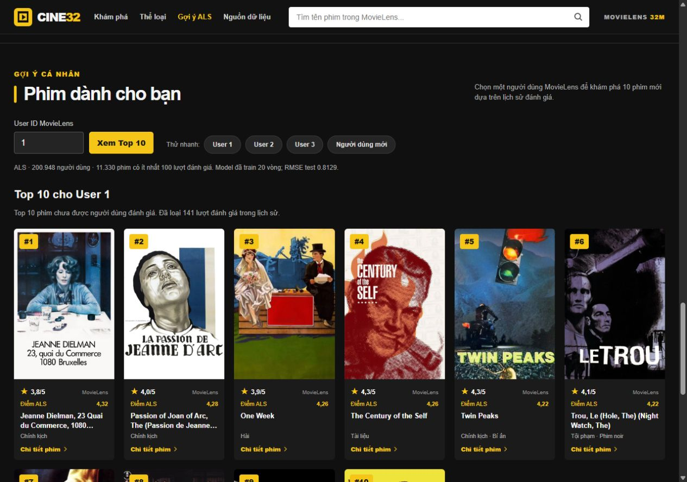
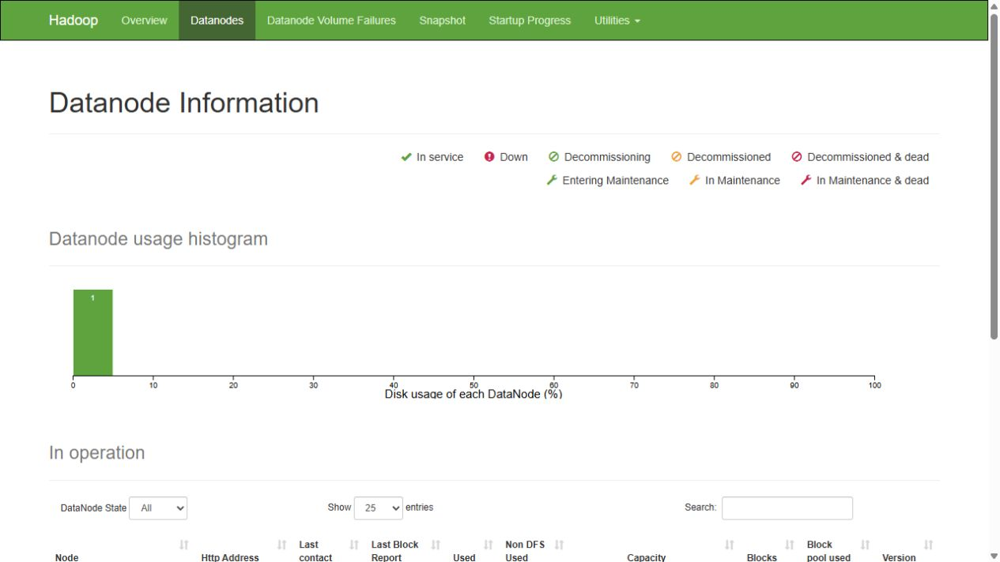

# HDFS và demo ALS theo User ID — CINE32

Cập nhật ngày 01/10/2026. Theo yêu cầu đã được xác nhận cho đồ án, cần có **HDFS thật** và **gợi ý ALS theo User ID**. Ứng dụng chính dùng React/TypeScript + FastAPI.

## 1. Gợi ý ALS trên ứng dụng

Model: `models/als_full_iter_20260922_120859/`, `rank=16`, `regParam=0.08`, `maxIter=20`. Model đã fit trên 28.709.236 dòng train + validation; RMSE test 0,812898. Không train lại khi chạy demo.

Tạo dữ liệu phục vụ từ model đã có rồi chạy web:

```powershell
py scripts/12_prepare_als_serving.py
Set-Location frontend
npm install
npm run build
Set-Location ..
py -m uvicorn web_api:app --host 127.0.0.1 --port 8502
```

Lệnh đầu tạo `artifacts/als_serving/factors_and_history.npz` và `manifest.json`: vector của 200.948 người dùng, 77.409 phim và chỉ mục lịch sử 32.000.204 lượt đánh giá. Artifact được bỏ qua bởi Git; cần tạo lại trên máy demo.

Nếu model nằm trong thư mục khác, truyền `--model-dir <thu_muc_model>` cho cả script 12 và script 13. Quy mô user/phim phụ thuộc model đã train; các số liệu trong hướng dẫn này là kết quả của full model hiện có.

Mở [CINE32](http://127.0.0.1:8502/#personalized), chọn **Gợi ý ALS** trong menu:

1. Nhập User ID `1`, bấm **Xem Top 10**: xem phim, poster, điểm cộng đồng và điểm ALS dự đoán.
2. Đổi sang User ID `2`: danh sách thay đổi theo vector sở thích.
3. Mở **Lịch sử đã đánh giá**: xem tối đa 12 phim gần nhất. Phim đã đánh giá không xuất hiện trong Top 10.
4. Chọn **Người dùng mới** hoặc nhập ID chưa có như `999999`: dùng bảng xếp hạng cộng đồng có trọng số và thông báo phương án dự phòng. Không gán điểm ALS cho kết quả này.
5. Bấm phim để xem chi tiết, mô tả, poster và liên kết IMDb/TMDB.

### Quy tắc thuật toán

- User đã có: tính `prediction = item_factor · user_factor` từ vector Spark ALS đã xuất.
- Tập ứng viên gồm phim có vector và ít nhất **100 lượt đánh giá trong train + validation** (11.330 phim), hạn chế nhiễu từ phim có rất ít lượt chấm.
- Loại phim trong lịch sử, sắp điểm dự đoán giảm dần, phá hòa bằng `movieId` tăng dần, lấy tối đa 10 phim.
- Điểm ALS có thể ngoài khoảng 0,5–5; giao diện giữ giá trị thực và ghi rõ ý nghĩa. Điểm cộng đồng MovieLens được hiển thị riêng theo thang 5 sao.
- **Demo trực tuyến** loại toàn bộ lịch sử gồm train/validation/test để không giới thiệu phim đã chấm. **Đánh giá offline** giữ giao thức cũ: fit train + validation, loại phim trong tập fit, chấm trên test. Không dùng demo để tính lại các độ đo test đã công bố.
- Khám phá theo thể loại vẫn trả mọi phim khớp ít nhất một thể loại, 24 phim/trang.

API: `GET /api/als/meta`, `GET /api/als/recommendations?user_id=1`, `GET /api/als/recommendations?user_id=0`.

## 2. HDFS một máy trên Windows

Apache Hadoop **3.3.4**, cùng phiên bản Hadoop client trong PySpark 3.5.7, Java 8/11 và Windows native helpers đã dùng cho Spark (`.hadoop/bin/winutils.exe`, `.hadoop/bin/hadoop.dll`). Binary và dữ liệu HDFS không đưa lên GitHub.

Script tải Hadoop từ kho chính thức Apache, đối chiếu SHA-512 và cài Common + HDFS trong `.hadoop/runtime/`. Cấu hình, dữ liệu vật lý, log và PID nằm trong `.hadoop/`. Không sửa biến môi trường hệ thống hay bật tính năng Windows.

```powershell
py scripts/11_hdfs_local.py install
py scripts/11_hdfs_local.py start --foreground
py scripts/11_hdfs_local.py status
```

Chờ NameNode/DataNode khởi động rồi chạy `status`; cần có **Live datanodes (1)**.

Giữ terminal HDFS mở; chạy `status`, pipeline Spark và ứng dụng trong terminal khác. `Ctrl+C` trong terminal HDFS sẽ dừng hai daemon. Khi đường dẫn dự án có dấu tiếng Việt, script tự chọn một ổ ảo còn trống (ưu tiên `R:`) bằng `subst`, trỏ tới chính thư mục dự án để Java 8 nạp DLL đúng. Đây là ánh xạ tạm, không sao chép hay chuyển dữ liệu; thông tin lưu tại `.hadoop/drive.json`.

| Dịch vụ | Địa chỉ |
| --- | --- |
| NameNode RPC | `hdfs://127.0.0.1:9000` |
| NameNode UI | [http://127.0.0.1:9870/](http://127.0.0.1:9870/) |
| DataNode UI | [http://127.0.0.1:9864/](http://127.0.0.1:9864/) |

Đây là **HDFS giả phân tán trên một máy**, NameNode/DataNode chạy trong tiến trình riêng. Spark vẫn chạy `local[4]`, không phải cụm nhiều máy. Các dịch vụ bind loopback để demo cục bộ.

NameNode chỉ format khi thư mục mới, chưa có dữ liệu. Script từ chối format nếu thư mục có dữ liệu nhưng thiếu `VERSION`. Không xóa `.hadoop/dfs/` để xử lý lỗi khởi động.

## 3. Spark đọc/ghi HDFS và bằng chứng

```powershell
py scripts/13_verify_hdfs_spark.py
```

Quy trình:

1. Kiểm tra DataNode đang hoạt động; đưa 4 CSV vào `/movielens/raw/`.
2. Spark đọc 32.000.204 ratings qua `hdfs://`, kiểm tra ID/rating/timestamp, loại trùng hoàn toàn, ghi Parquet trên HDFS.
3. Đọc lại Parquet, đối chiếu số dòng; chuyển movies/tags/links sang Parquet trên HDFS.
4. Tạo checkpoint HDFS và bảng phân bố rating.
5. Đưa vector model đã train lên HDFS; Spark đọc vector và catalog từ HDFS, tính Top 10 cho User `1`, loại lịch sử đã đánh giá. Không train lại.
6. Ghi Top 10 lên HDFS và bằng chứng tại `reports/tables/hdfs_spark_verification.json`.

Mỗi lần chạy tạo `/movielens/runs/hdfs_YYYYMMDD_HHMMSS/`, giữ đầu ra cũ. CSV đã có được kiểm tra kích thước; script từ chối ghi đè nếu kích thước khác.

```powershell
py scripts/11_hdfs_local.py dfs -ls -h /movielens/raw
py scripts/11_hdfs_local.py dfs -ls /movielens/runs
py scripts/11_hdfs_local.py dfs -du -h /movielens
```

Demo 5–7 phút: chạy pipeline trước buổi bảo vệ, mở sẵn NameNode UI và JSON bằng chứng. Trình bày 1 DataNode, CSV, đường dẫn Parquet, số dòng đọc lại và Top 10 ALS; sau đó đổi User ID trên CINE32. Benchmark CSV/Parquet và kết quả train trước đây dùng dữ liệu local; không mô tả lại thành benchmark/train trên HDFS.

Dừng sau khi dùng:

```powershell
py scripts/11_hdfs_local.py stop
```

## 4. Kiểm tra

```powershell
py -m unittest discover -s tests -v
```

Kiểm tra ALS gồm điểm từ vector, loại phim đã đánh giá, ngưỡng ứng viên, phá hòa, User ID mới và API. Frontend kiểm tra bằng `npm run build` và thao tác trình duyệt.

### Kết quả đã kiểm chứng ngày 01/10/2026

- `hdfs_spark_verification.json`: 1 DataNode, Hadoop native nạp thành công, đủ 32.000.204 ratings, 87.585 movies, 2.000.072 tags, 87.585 links; Parquet ratings đọc lại khớp số dòng. Lần chạy cuối mất 80,826 giây trên máy hiện tại, không gồm tải/cài Hadoop hay train model.
- `als_serving_verification.json`: kiểm tra User 1, 2, 3, 100, 500, 200948; mỗi user nhận 10 phim và không trùng lịch sử. ID mới dùng fallback. Top 10 User 1 từ Spark/HDFS và web khớp nhau; chênh lệch số thực tối đa khoảng `3,62e-7`.
- 11 bài kiểm tra đạt; frontend build thành công; kiểm tra giao diện ở chiều rộng 375 px và 1280 px, không tràn ngang.





Tham khảo: [Apache Hadoop một node](https://hadoop.apache.org/docs/r3.3.4/hadoop-project-dist/hadoop-common/SingleCluster.html), [lệnh HDFS](https://hadoop.apache.org/docs/r3.3.4/hadoop-project-dist/hadoop-hdfs/HDFSCommands.html), [Java hỗ trợ bởi Hadoop](https://cwiki.apache.org/confluence/spaces/HADOOP/pages/100827883/Hadoop%2BJava%2BVersions).
