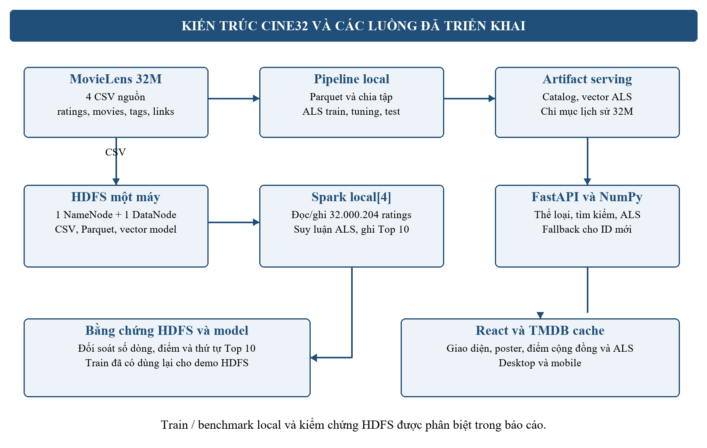
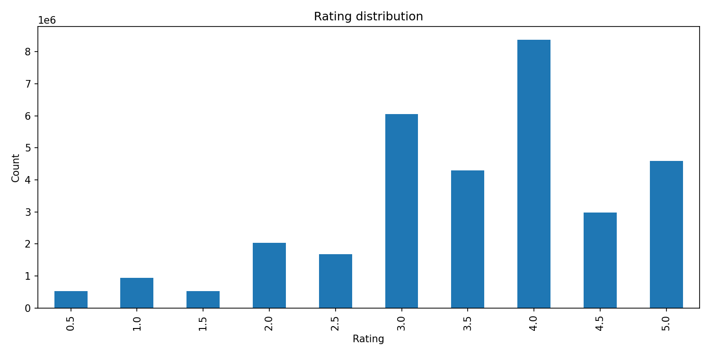
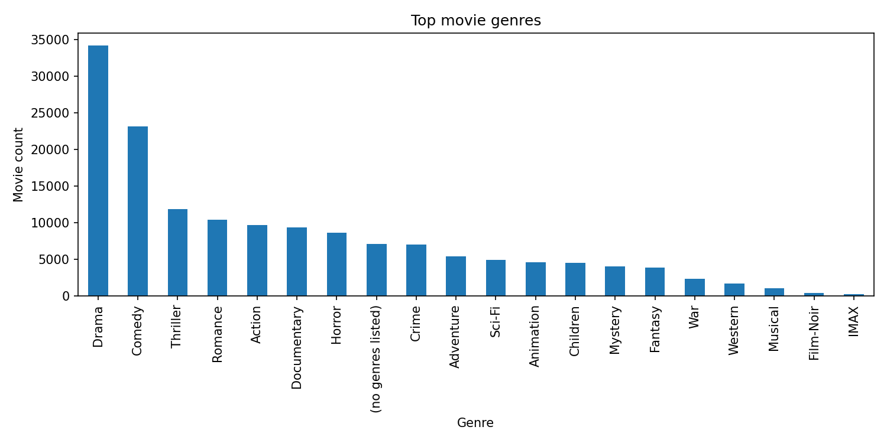
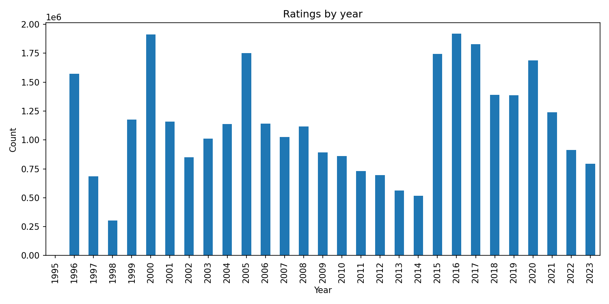
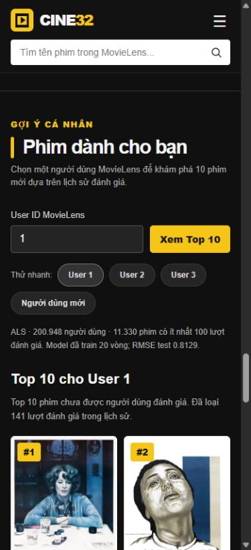

# Hệ thống gợi ý phim trên MovieLens 32M

Học phần: Nhập môn Big Data. Đề tài 15. Thời gian báo cáo: tháng 10 năm 2026.

Giảng viên hướng dẫn: ............................................................

Nhóm: ............................. Lớp: ............................................

Sinh viên 1: ........................................ MSSV: .............................

Sinh viên 2: ........................................ MSSV: .............................

## LỜI CAM ĐOAN

Các kết quả trình bày trong báo cáo được đối chiếu với dữ liệu, mã nguồn và bảng thực nghiệm của hệ thống CINE32. Nguồn bộ dữ liệu MovieLens 32M và các tài liệu kỹ thuật được ghi trong phần Tài liệu tham khảo. Các giới hạn triển khai và kiểm thử được nêu rõ, bao gồm cấu hình một máy, dữ liệu lịch sử và phạm vi đánh giá mô hình.

Người thực hiện chịu trách nhiệm kiểm tra nội dung, xác nhận thông tin thành viên và công việc thực tế trước khi ký và nộp báo cáo.

Đại diện nhóm ký tên: ............................................................

## LỊCH LÀM VIỆC NHÓM

Kế hoạch triển khai được chia thành 8 tuần. Bảng dưới ghi nhận đầu ra kỹ thuật đã có; nghiệm thu trên máy khác và diễn tập là các bước chưa được xác nhận hoàn tất.

| Tuần | Công việc | Đầu ra và tình trạng |
| --- | --- | --- |
| 1 | Xác định bài toán, chuẩn bị môi trường, tải dữ liệu | Đủ 4 CSV; số dòng và checksum được đối soát |
| 2 | Chuyển CSV sang Parquet và kiểm tra schema | Parquet local; bảng dung lượng lưu trữ |
| 3 | EDA và chia dữ liệu theo thời gian từng user | Biểu đồ; tập train, validation, test cho sample và full |
| 4 | Xây dựng baseline và ALS trên sample | Kết quả Global Mean, Item Mean và ALS |
| 5 | Tuning tham số và mở rộng lên toàn bộ dữ liệu | So sánh 5, 10, 15, 20 vòng lặp; lưu model cuối |
| 6 | Đánh giá test, chẩn đoán Top K, xây dựng CINE32 | Metric test; catalog; web React và FastAPI |
| 7 | Benchmark, HDFS và demo ALS theo User ID | Spark đọc/ghi 32M trên HDFS; gợi ý cá nhân và bằng chứng |
| 8 | Hoàn thiện hồ sơ và kiểm tra trước bảo vệ | Báo cáo; còn PPT, thông tin nhóm, kiểm tra chéo và diễn tập |

Việc bổ sung HDFS và demo ALS theo User ID được kiểm chứng ngày 01/10/2026. Các giai đoạn train, tuning và benchmark trước đó sử dụng filesystem local; thí nghiệm HDFS được chạy riêng và không thay đổi metric đã công bố.

## CÔNG VIỆC CỦA TỪNG THÀNH VIÊN

| Thành viên và MSSV | Công việc thực tế | Minh chứng | Đóng góp |
| --- | --- | --- | --- |
| ................................ | ................................ | ................................ | ........ % |
| ................................ | ................................ | ................................ | ........ % |

Ngày xác nhận: ............................ Chữ ký thành viên 1: ............................ Chữ ký thành viên 2: ............................

## CHƯƠNG 1 TỔNG QUAN ĐỀ TÀI

### 1.1 Tên đề tài

Xây dựng hệ thống gợi ý phim sử dụng Apache Spark và thuật toán ALS trên bộ dữ liệu MovieLens 32M.

### 1.2 Bối cảnh và vấn đề

Danh mục phim lớn khiến người xem khó tìm nội dung phù hợp chỉ bằng cách duyệt tên phim. Khi đã có lịch sử đánh giá, hệ thống có thể học quan hệ giữa người dùng và phim để gợi ý nội dung họ chưa đánh giá. Với người dùng mới, một luồng khám phá theo thể loại và điểm cộng đồng giúp họ sử dụng ứng dụng ngay.

MovieLens 32M chứa 32.000.204 lượt đánh giá của 200.948 người dùng cho một danh mục 87.585 phim. Ma trận đầy đủ có khoảng 17,6 tỷ ô; nếu lưu mỗi ô bằng float32 thì cần khoảng 70,4 GB, chưa tính phần bộ nhớ phụ. Vì vậy, đề tài lưu các tương tác đã quan sát và học vector nhân tố có kích thước nhỏ thay vì dựng ma trận dày đặc.

Bài toán gồm hai phần cần đánh giá riêng: dự đoán điểm cho một cặp người dùng–phim và xếp hạng một danh sách phim chưa được người dùng đánh giá. RMSE thấp không đủ để kết luận chất lượng Top 10 tốt. Báo cáo phân tích cả sai số dự đoán, chất lượng xếp hạng và khả năng xử lý dữ liệu.

### 1.3 Mô tả sản phẩm

Sản phẩm CINE32 gồm pipeline xử lý dữ liệu theo lô và ứng dụng web. Pipeline tạo Parquet, thống kê dữ liệu, chia tập, huấn luyện ALS, đánh giá và xuất catalog cùng vector phục vụ. Web dùng React/TypeScript và FastAPI, hiển thị phim kèm poster, điểm đánh giá và thông tin chi tiết.

Luồng khám phá tự cập nhật khi người dùng chọn thể loại; tất cả phim khớp được truy cập qua phân trang 24 phim mỗi trang. Luồng Gợi ý ALS nhận User ID có trong MovieLens, tính Top 10 theo vector cá nhân và loại các phim đã đánh giá. Với ID chưa có, hệ thống chuyển sang xếp hạng cộng đồng có trọng số và thông báo rõ.

### 1.4 Mục tiêu đề tài

- Kiểm tra và xử lý toàn bộ MovieLens 32M, có schema và số dòng đối soát.
- Sử dụng Spark cho huấn luyện ALS và chứng minh Spark đọc/ghi dữ liệu qua HDFS.
- Chọn tham số bằng validation, đánh giá bằng test tách biệt và so sánh với baseline.
- Phân tích nguyên nhân khi dự đoán rating tốt nhưng xếp hạng Top K còn thấp.
- Xây dựng giao diện minh họa cả khám phá theo thể loại và gợi ý cá nhân hóa.
- Cung cấp mã nguồn, hướng dẫn vận hành, bảng kết quả và minh chứng kiểm thử.

### 1.5 Đối tượng sử dụng

Người xem sử dụng CINE32 để tìm phim theo thể loại, tra cứu thông tin và xem gợi ý. Trong bản demo, User ID là mã đã ẩn danh của bộ dữ liệu, không phải tài khoản đăng nhập của khách hàng thật.

Người vận hành chạy các script chuẩn bị dữ liệu, model, HDFS và web. Giảng viên có thể đối chiếu giao diện, bảng metric, số dòng đọc lại từ HDFS và mã nguồn để đánh giá quy trình.

### 1.6 Phạm vi triển khai

Hệ thống dùng dữ liệu lịch sử tĩnh, xử lý theo lô và chạy cục bộ. HDFS có một NameNode và một DataNode; Spark sử dụng local[4]. Đây là cấu hình giả phân tán trên một máy, chưa phải cụm nhiều máy.

Ứng dụng chưa có đăng ký tài khoản, nhập đánh giá mới hay cập nhật vector người dùng theo thời gian thực. Poster và mô tả được bổ sung từ TMDB; các điểm cộng đồng hiển thị trong ứng dụng được tổng hợp từ MovieLens, không phải điểm IMDb. Phần khám phá theo thể loại dùng weighted score, còn ALS cá nhân hóa được trình bày ở mục riêng.

### 1.7 Yêu cầu phi chức năng và quy ước

Kết quả phải truy vết được đến tệp dữ liệu và cấu hình model. Giao diện phân biệt điểm trung bình cộng đồng với điểm dự đoán ALS; phim chưa có đánh giá không bị gán thành 0 sao. Khi thiếu poster, giao diện có ảnh thay thế để người dùng vẫn đọc được tên và điểm phim.

Các token API, dataset, model, cache và runtime được giữ cục bộ theo .gitignore. Repository công khai chứa source, tài liệu và các bảng tổng hợp; cần chuẩn bị artifact riêng khi chuyển sang máy demo khác.

## CHƯƠNG 2 CƠ SỞ LÝ THUYẾT VÀ THIẾT KẾ HỆ THỐNG

### 2.1 Phân tích yêu cầu chức năng

| Mã | Yêu cầu | Kết quả cần quan sát |
| --- | --- | --- |
| F01 | Lọc một hoặc nhiều thể loại | Tự cập nhật danh sách; mọi phim khớp được phân trang |
| F02 | Tìm kiếm tên phim | Danh sách thay đổi theo từ khóa và bộ lọc |
| F03 | Xem chi tiết phim | Poster, tên, thể loại, điểm cộng đồng và mô tả |
| F04 | Gợi ý cá nhân theo User ID | Top 10 có thứ hạng và điểm ALS riêng |
| F05 | Loại phim đã đánh giá | Kết quả không giao với lịch sử của user |
| F06 | Phục vụ người dùng mới | Có danh sách dự phòng; không gán điểm ALS |
| F07 | Đọc và ghi qua HDFS | Đường dẫn hdfs:// và số dòng Parquet đọc lại khớp |
| F08 | Đánh giá mô hình | Có validation, test, baseline và phân tích hạn chế |

### 2.2 Dữ liệu lớn và lựa chọn công nghệ

Đặc trưng khối lượng thể hiện ở hàng chục triệu tương tác và độ thưa khoảng 99,818% của ma trận đánh giá. Dữ liệu có nhiều dạng: số, timestamp, tiêu đề phim, nhãn văn bản, danh sách thể loại và mã liên kết ngoài. Trong đề tài này, dữ liệu được xử lý theo lô; chưa triển khai thu thập tương tác hoặc streaming.

Spark chia công việc thành các phân vùng, cho phép thực hiện join, tổng hợp và huấn luyện song song. Parquet lưu các cột có kiểu dữ liệu, thuận tiện cho việc đọc chọn cột và nén dữ liệu. HDFS cung cấp không gian lưu trữ với NameNode quản lý metadata và DataNode lưu block. Cấu hình demo dùng replication bằng 1 do chỉ có một DataNode [3], [4].

HDFS và Parquet giải quyết hai lớp khác nhau: HDFS là hệ thống lưu trữ, còn Parquet là định dạng tệp. Một tệp Parquet có thể nằm trên đĩa local hoặc trên HDFS. Báo cáo ghi rõ vị trí lưu ở từng thí nghiệm để kết quả không bị nhầm lẫn.

### 2.3 Lọc cộng tác và thuật toán ALS

Lọc cộng tác học từ các đánh giá của nhiều người dùng. ALS biểu diễn mỗi user và mỗi phim bằng một vector nhân tố ẩn. Điểm dự đoán là tích vô hướng của hai vector:

$$\hat{r}_{u,i}=\mathbf{u}_u^{T}\mathbf{v}_i$$

ALS luân phiên cập nhật ma trận người dùng và ma trận phim, giữ một ma trận cố định khi tối ưu ma trận còn lại. Với MovieLens, rating là phản hồi tường minh nên hệ thống dùng implicitPrefs=False. Các ô chưa có đánh giá không được điền bằng 0 [3].

| Tham số | Ý nghĩa | Cấu hình model cuối |
| --- | --- | --- |
| rank | Số nhân tố trong mỗi vector | 16 |
| regParam | Điều chuẩn, hạn chế khớp quá mức | 0,08 |
| maxIter | Số vòng cập nhật luân phiên | 20 |
| implicitPrefs | Chọn phản hồi tường minh hoặc ngầm định | False |
| coldStartStrategy | Xử lý cặp thiếu vector khi chấm metric | drop |
| numUserBlocks / numItemBlocks | Phân chia user và phim khi train | 50 / 50 |

Model dùng điều chuẩn ALS-WR, trong đó mức điều chuẩn được điều chỉnh theo số đánh giá của user hoặc phim. regParam và rank được chọn trên sample; maxIter được so sánh trên train đầy đủ. Cấu hình được chọn theo kết quả validation, không theo test [3].

### 2.4 Xếp hạng cộng đồng và xử lý người dùng mới

Điểm trung bình đơn thuần có thể đặt một phim chỉ có một lượt chấm 5 sao lên đầu danh sách. CINE32 dùng weighted score để kéo các phim ít lượt chấm về mức trung bình chung:

$$s_i=\frac{v_iR_i+mC}{v_i+m}$$

Trong đó R_i là điểm trung bình của phim, v_i là số lượt đánh giá, C là điểm trung bình toàn cục và m=100 là hệ số co rút. Catalog hiện có C xấp xỉ 3,546251, được tổng hợp từ train + validation.

Weighted score hỗ trợ khám phá theo thể loại và danh sách dự phòng cho User ID mới. Phương án này chưa học sở thích riêng của người dùng mới; cá nhân hóa cho họ cần thêm dữ liệu đánh giá và cơ chế cập nhật vector.

### 2.5 Độ đo đánh giá

RMSE là căn bậc hai của trung bình bình phương sai số; MAE là trung bình trị tuyệt đối sai số. Hai độ đo được tính trên các cặp có dự đoán hữu hạn. Coverage đi kèm cho biết tỷ lệ dòng có thể chấm, tránh hiểu rằng RMSE đại diện cho cả những dòng bị drop.

$$\mathrm{RMSE}=\sqrt{\frac{1}{N}\sum(r-\hat r)^2} \qquad \mathrm{MAE}=\frac{1}{N}\sum|r-\hat r|$$

Với Top K, một phim được xem là liên quan khi rating trong test từ 4,0 trở lên. Precision@10 đo tỷ lệ phim liên quan trong 10 gợi ý; Recall@10 đo tỷ lệ phim liên quan của user được tìm lại. NDCG@10 tính thêm vị trí của kết quả, thưởng cao hơn khi phim liên quan nằm gần đầu.

$$\mathrm{Precision@K}=\frac{|Rec_u@K\cap Rel_u|}{K} \qquad \mathrm{Recall@K}=\frac{|Rec_u@K\cap Rel_u|}{|Rel_u|}$$

Các độ đo xếp hạng được lấy trung bình trên tập user đủ điều kiện. Khi so sánh kết quả, báo cáo luôn chỉ rõ tập user và số phim ứng viên; kết quả toàn bộ test và kết quả sample 10.000 user không được dùng thay thế nhau.

### 2.6 Mô hình dữ liệu

| Bảng | Số bản ghi | Các trường chính |
| --- | ---: | --- |
| ratings | 32.000.204 | userId, movieId, rating, timestamp |
| movies | 87.585 | movieId, title, genres |
| tags | 2.000.072 | userId, movieId, tag, timestamp |
| links | 87.585 | movieId, imdbId, tmdbId |

movieId nối ratings, movies, tags và links. userId nối các lượt đánh giá và nhãn của cùng một mã người dùng ẩn danh. timestamp ghi theo Unix time; lịch sử được sắp tăng dần khi chia tập. imdbId được giữ dạng chuỗi để bảo toàn số 0 ở đầu.

ratings là dữ liệu huấn luyện chính. movies cung cấp tên và thể loại, links hỗ trợ tra cứu hình ảnh ngoài; tags được xử lý và thống kê nhưng chưa tham gia vector ALS. Dữ liệu phục vụ web gồm catalog tổng hợp, vector user/phim và chỉ mục lịch sử, giúp web không phải quét toàn bộ CSV ở mỗi yêu cầu.

### 2.7 Kiến trúc và luồng xử lý



Tầng offline tạo dữ liệu xử lý và model; tầng web nạp artifact phục vụ. Pipeline train/tuning trước đây đọc dữ liệu local. Pipeline HDFS bổ sung đọc 4 CSV, ghi Parquet, kiểm tra số dòng, đọc vector model đã train và ghi kết quả suy luận.

FastAPI đọc vector để tính gợi ý bằng NumPy; điểm được đối chiếu với phép tính Spark từ HDFS. TMDB cung cấp poster và mô tả qua cache SQLite, tách khỏi phần tính điểm. Không khởi động Spark hoặc train lại model cho mỗi lần người dùng nhấn xem Top 10.

### 2.8 Phân tích nghiệp vụ

**Bài toán nghiệp vụ.** Người xem cần tìm được phim phù hợp trong danh mục lớn, có thông tin để cân nhắc lựa chọn và có gợi ý dựa trên lịch sử khi dữ liệu cho phép. CINE32 hỗ trợ khám phá toàn bộ danh mục theo thể loại, tìm tên phim, xem thông tin phim và minh họa gợi ý cá nhân bằng User ID MovieLens. Giá trị của hệ thống là giảm thao tác tìm kiếm và cung cấp căn cứ lựa chọn; chưa có khảo sát để định lượng mức hài lòng hay mức tăng tương tác của người xem.

**Phạm vi hiện tại.** Người xem sử dụng web mà không đăng nhập. User ID là mã ẩn danh trong bộ dữ liệu, được nhập để demo một hồ sơ sở thích đã có, không phải danh tính được xác thực của người đang mở web. Chưa có chức năng đăng ký, chấm điểm mới, lưu thể loại yêu thích, danh sách xem sau, mua vé hoặc phát phim. Các chức năng này không được đưa vào sơ đồ như chức năng đã triển khai.

**Tác nhân và trách nhiệm.** Tác nhân là người hoặc dịch vụ bên ngoài tương tác với hệ thống; React, FastAPI, Spark, ALS và HDFS là các thành phần bên trong phạm vi giải pháp, không phải tác nhân người dùng.

| Tác nhân | Mục tiêu | Cách tương tác hiện tại |
| --- | --- | --- |
| Người xem | Khám phá, xem chi tiết, xem gợi ý và lịch sử mẫu | Giao diện CINE32; không cần tài khoản |
| Người vận hành | Chuẩn bị dữ liệu, huấn luyện, đóng gói và kiểm chứng demo | Chạy script và lệnh trong terminal; chưa có trang quản trị |
| Dịch vụ TMDB | Cung cấp poster và thông tin bổ sung | API ngoài, tải nền và cache; không quyết định điểm MovieLens hay thứ hạng ALS |

**Đầu vào và đầu ra.** Luồng khám phá nhận tập thể loại, từ khóa và số trang, trả về danh sách phim phù hợp cùng tổng số kết quả. Luồng gợi ý nhận User ID, trả về tối đa 10 phim, chiến lược sử dụng và lịch sử mẫu nếu ID có trong model. Luồng vận hành nhận 4 CSV MovieLens và cấu hình, tạo Parquet, tập chia, model, catalog, vector serving và bảng minh chứng.

**Điểm tách biệt giữa hai nghiệp vụ.** Khám phá theo thể loại lọc toàn danh mục và xếp hạng bằng mức khớp thể loại cùng weighted score. Gợi ý ALS dùng lịch sử của User ID và tập phim đủ điều kiện. Bộ lọc thể loại trên màn hình khám phá hiện không lọc danh sách ALS; lựa chọn thể loại cũng không tự tạo vector cho người dùng mới.

### 2.9 Quy trình và quy tắc nghiệp vụ

**Quy trình khám phá phim.** Người xem mở danh mục, chọn hoặc bỏ chọn thể loại; hệ thống tự tải lại kết quả từ trang 1. Nếu cần thu hẹp kết quả, người xem nhập tên phim và gửi tìm kiếm. Danh sách được phân trang để người xem duyệt mọi phim khớp; nhấn vào thẻ phim sẽ mở hộp chi tiết. Poster có thể được bổ sung sau khi tên và điểm phim đã hiển thị.

**Quy trình gợi ý theo User ID.** Người xem nhập ID và chọn Xem Top 10 hoặc chọn ID mẫu. Hệ thống kiểm tra đầu vào và tra vector. Nếu có vector, hệ thống chấm tập ứng viên, loại phim đã đánh giá, sắp xếp và trả tối đa 10 phim. Nếu không có vector, hệ thống trả danh sách dự phòng theo weighted score và thông báo không có lịch sử trong model. Người xem có thể mở lịch sử mẫu và chi tiết các phim nhận được.

**Quy trình vận hành.** Người vận hành kiểm tra dữ liệu, chuyển Parquet, khảo sát, chia tập, train/tuning và đánh giá; sau đó tạo catalog và đóng gói serving. Demo HDFS thực hiện ETL và suy luận bằng model đã có, đối chiếu số dòng và Top 10. Web đọc artifact đã chuẩn bị; không train lại mỗi lần nhận yêu cầu. Train và benchmark local được phân biệt với lần kiểm chứng HDFS bổ sung.

| Mã | Quy tắc nghiệp vụ | Ý nghĩa đối với người sử dụng |
| --- | --- | --- |
| BR01 | Chọn nhiều thể loại theo phép HOẶC | Phim khớp ít nhất một thể loại được giữ; ưu tiên phim khớp nhiều thể loại |
| BR02 | Không chọn thể loại thì duyệt toàn catalog | Phim chưa có thể loại vẫn có thể xuất hiện trong danh mục chung |
| BR03 | Khám phá trả mọi phim khớp, 24 phim mỗi trang | Không có lựa chọn giới hạn số phim hay nút gợi ý cho bộ lọc thể loại |
| BR04 | Đổi thể loại hoặc gửi tìm kiếm đưa về trang 1 | Từ khóa tìm kiếm được kết hợp với bộ lọc hiện tại; tìm theo tên, không phân biệt hoa thường |
| BR05 | Xếp khám phá theo số thể loại khớp, weighted score, lượt chấm, movieId | Ba tiêu chí đầu giảm dần; movieId tăng dần để phá hòa. Khi không lọc, bỏ tiêu chí số thể loại khớp |
| BR06 | Điểm cộng đồng lấy từ train + validation MovieLens | Phim chưa được chấm hiển thị chưa có đánh giá; không gán 0 sao hay dùng điểm IMDb |
| BR07 | ALS dùng phim có vector và ít nhất 100 lượt chấm trong catalog | Demo hiện có 11.330 ứng viên; điều kiện này không loại phim khỏi danh mục khám phá |
| BR08 | Gợi ý ALS loại toàn bộ phim ID đã chấm trong dataset | Lịch sử serving gồm train, validation và test; protocol metric offline được trình bày riêng |
| BR09 | ALS sắp điểm giảm dần, movieId tăng dần; trả tối đa 10 phim | Chỉ giữ điểm hữu hạn; có thể trả ít hơn 10 nếu không còn đủ ứng viên |
| BR10 | ID không có vector dùng weighted score trên tập ứng viên serving | Không hiển thị điểm ALS cho kết quả dự phòng; không giả định đã cá nhân hóa |
| BR11 | Điểm ALS và điểm cộng đồng là hai đại lượng khác nhau | ALS có thể vượt 5; không trình bày như sao cộng đồng trong khoảng 0,5–5 |
| BR12 | Thiếu ảnh, token hoặc lỗi TMDB dùng ảnh thay thế | Danh sách và điểm MovieLens vẫn có thể được xem; thông tin ngoài có thể chưa sẵn sàng |

ID hợp lệ là số nguyên từ 0 đến 2.147.483.647. API trả 422 khi tham số vi phạm giới hạn; ID hợp lệ nhưng không có trong vector là trường hợp dự phòng, không phải lỗi. Thiếu catalog hoặc artifact ALS trả 503 ở API tương ứng. Trang vượt số trang được đưa về trang cuối; danh sách rỗng trả page=1 và totalPages=0.

### 2.10 Sơ đồ Use Case

**Phạm vi giao diện.** Hình 2.2 đặt Người xem và TMDB ngoài biên CINE32. Các đường nối không có mũi tên là quan hệ tương tác, không biểu diễn thứ tự thực hiện. Các trường hợp tải ảnh bên ngoài có điều kiện và có phương án thay thế.


UC02, UC03 và UC04 mở rộng UC01 khi người xem thao tác với bộ lọc, gửi tìm kiếm hoặc đổi trang. UC08 mở rộng UC06 khi ID không có vector; UC07 mở rộng UC06 khi có lịch sử và người xem yêu cầu mở lịch sử. UC09 mở rộng UC05 khi thông tin TMDB cần bổ sung. Poster trên danh sách cũng được nạp nền qua cùng dịch vụ; sơ đồ không ngụ ý phải mở chi tiết mới có poster.

Quan hệ extend có mũi tên nét đứt từ use case mở rộng đến use case gốc và ghi điều kiện. Đây là hành vi tùy điều kiện, không phải thao tác bắt buộc. Không dùng include giữa khám phá và gợi ý ALS vì hai chức năng có thể được dùng độc lập. Các bước chấm điểm và loại phim đã xem được mô tả trong UC06, không biến mọi bước xử lý nội bộ thành mục tiêu riêng của người xem.

**Phạm vi vận hành.** Hình 2.3 mô tả người vận hành chạy pipeline bằng terminal. Các nhóm công việc không được vẽ thành include liên hoàn vì chúng có thể chạy riêng và tái sử dụng artifact đã tồn tại; sơ đồ Use Case không thay thế thứ tự pipeline ở mục 2.7.


| Mã | Use Case | Bằng chứng triển khai |
| --- | --- | --- |
| UC01–UC04 | Khám phá, lọc, tìm và chuyển trang | App.tsx; GET /api/movies; genre_recommender.py |
| UC05, UC09 | Xem chi tiết và bổ sung thông tin phim | MovieModal; GET /api/posters; poster_loader.py; poster_cache.py |
| UC06–UC08 | Gợi ý theo ID, lịch sử và danh sách dự phòng | PersonalRecommendations.tsx; GET /api/als/recommendations; als_recommender.py |
| OP01 | Kiểm tra và chuẩn bị dữ liệu | scripts/00–03 |
| OP02 | Huấn luyện và đánh giá ALS | scripts/04–05, 09–10 |
| OP03 | Tạo catalog và đóng gói serving | scripts/06–08, 12 |
| OP04 | Vận hành và kiểm chứng HDFS | scripts/11, 13 |
| OP05 | Khởi chạy web và kiểm tra demo | Uvicorn; frontend build; tests; JSON đối soát |

### 2.11 Đặc tả Use Case

#### UC01 Khám phá danh mục

Tác nhân: Người xem. Kích hoạt: mở mục Khám phá. Tiền điều kiện: catalog sẵn sàng. Luồng chính: hệ thống đọc danh mục, xếp theo weighted score và lượt chấm, trả trang đầu cùng tổng số phim; giao diện hiện tên, thể loại, điểm và trạng thái ảnh. Hậu điều kiện: người xem có danh sách để duyệt; không ghi dữ liệu sở thích. Ngoại lệ: thiếu catalog thì báo không tải được và cho thử lại; chưa có ảnh thì dùng placeholder.

#### UC02 Lọc thể loại

Tác nhân: Người xem. Kích hoạt: chọn hoặc bỏ chọn chip thể loại trong UC01. Luồng chính: cập nhật tập thể loại, đặt trang 1, lọc phim khớp ít nhất một thể loại, xếp theo BR05 và hiển thị kết quả; giữ từ khóa đang áp dụng. Chọn Tất cả phim xóa tập thể loại. Hậu điều kiện: mọi phim khớp có thể được duyệt qua phân trang. Ngoại lệ: không có kết quả thì hiện thông báo; API từ chối thể loại không hợp lệ bằng 422.

#### UC03 Tìm tên phim

Tác nhân: Người xem. Kích hoạt: gửi biểu mẫu tìm kiếm hoặc nhấn Enter. Luồng chính: bỏ khoảng trắng hai đầu từ khóa, đặt trang 1, tìm chuỗi trong tên gốc hoặc tên hiển thị rồi kết hợp bộ lọc thể loại hiện tại. Hậu điều kiện: danh sách phản ánh từ khóa đã gửi. Ngoại lệ: không có kết quả thì gợi ý đổi từ khóa; xóa tìm kiếm bỏ điều kiện tên. API giới hạn từ khóa 100 ký tự; giao diện hiện gửi biểu mẫu, không tự tìm sau từng ký tự.

#### UC04 Chuyển trang

Tác nhân: Người xem. Tiền điều kiện: đã có danh sách kết quả. Kích hoạt: chọn trang trước, trang sau hoặc nhập số trang. Luồng chính: yêu cầu trang trong cùng tập thể loại và từ khóa, nhận tối đa 24 phim và cập nhật danh sách. Hậu điều kiện: người xem tiếp tục duyệt tập kết quả. Ngoại lệ: trang quá lớn được API đưa về trang cuối; khi không có kết quả, giao diện không cung cấp chuyển trang hữu ích.

#### UC05 Xem chi tiết phim

Tác nhân: Người xem. Kích hoạt: nhấn thẻ phim hoặc một phim trong lịch sử. Luồng chính: mở hộp chi tiết từ dữ liệu phim đã nhận; hiện tên, thể loại, poster, điểm cộng đồng và mô tả nếu có. Điểm ALS hiện riêng khi mở phim từ gợi ý; điểm từng chấm nằm ở danh sách lịch sử. Người xem đóng hộp để trở lại danh sách. Ngoại lệ: thiếu mô tả hay poster thì thông báo hoặc dùng ảnh thay thế; chưa có lượt chấm thì hiện chưa có đánh giá.

#### UC06 Xem gợi ý theo User ID

Tác nhân: Người xem. Tiền điều kiện: catalog và artifact ALS sẵn sàng. Kích hoạt: gửi ID, chọn ID mẫu hoặc mở mục gợi ý với ID mặc định. Luồng chính: kiểm tra ID; nếu có vector, chấm tập ứng viên bằng tích vô hướng, loại các phim trong lịch sử, sắp thứ hạng theo BR09; trả phim, điểm ALS và lịch sử mẫu. Hậu điều kiện: tối đa 10 phim chưa được ID đánh giá. Ngoại lệ: ID không có vector đi UC08; sai đầu vào trả 422, thiếu artifact trả 503; hết ứng viên trả danh sách rỗng.

#### UC07 Xem lịch sử mẫu

Tác nhân: Người xem. Tiền điều kiện: UC06 đã trả lịch sử của một ID có vector. Kích hoạt: mở khối Lịch sử đã đánh giá. Luồng chính: hiện tối đa 12 phim gần nhất có trong catalog theo dữ liệu serving, kèm điểm mà ID từng chấm; có thể nhấn để mở UC05. Hậu điều kiện: người xem hiểu lịch sử dùng để loại phim đã chấm. Ngoại lệ: ID mới không có lịch sử thì không hiện khối này. Đây là lịch sử MovieLens, không phải nhật ký truy cập web.

#### UC08 Xem phim dự phòng

Tác nhân: Người xem. Điều kiện mở rộng UC06: ID hợp lệ nhưng không có vector. Luồng chính: chọn tối đa 10 phim theo weighted score, lượt chấm và movieId trong tập ứng viên serving; hiện thông báo chưa có lịch sử và không có điểm ALS. Hậu điều kiện: người mới vẫn có danh sách tham khảo. Không train mới hoặc suy ra sở thích từ ID; không gán phim dự phòng thành gợi ý đã cá nhân hóa.

#### UC09 Bổ sung thông tin phim

Tác nhân chính: Người xem qua thao tác UC05; tác nhân hỗ trợ: TMDB. Điều kiện mở rộng: cần thông tin ngoài chưa có sẵn. Luồng chính: backend đọc cache còn hạn, đưa tra cứu thiếu vào hàng đợi nền, gọi TMDB nếu có cấu hình, lưu kết quả phù hợp rồi cập nhật thông tin trên giao diện. Ngoại lệ: thiếu tmdbId/token, không tìm thấy hoặc lỗi mạng thì giữ dữ liệu MovieLens và placeholder. Việc làm giàu ảnh cũng chạy khi tải danh sách; không ghi đè rating bằng vote_average của TMDB.

#### OP01 Chuẩn bị dữ liệu

Tác nhân: Người vận hành. Tiền điều kiện: 4 CSV và môi trường đã chuẩn bị. Luồng chính: kiểm tra checksum và schema, chuyển Parquet, tạo EDA, chia lịch sử theo thời gian từng user. Hậu điều kiện: có dữ liệu xử lý và số liệu kiểm tra. Ngoại lệ: thiếu tệp hoặc dữ liệu không đạt yêu cầu thì xử lý trước khi train; không công bố số liệu từ đầu ra chưa được đối soát.

#### OP02 Huấn luyện và đánh giá

Tác nhân: Người vận hành. Tiền điều kiện: tập chia và Spark sẵn sàng. Luồng chính: chạy baseline và ALS, tuning trên validation, fit cấu hình cuối trên train + validation, chấm test và lưu model/metric; phân tích ranking và benchmark riêng. Hậu điều kiện: có model truy vết được tới cấu hình. Ngoại lệ: thiếu tài nguyên hoặc job lỗi thì không coi là train thành công; kết quả sau phân tích ngưỡng trên test cần holdout mới để xác nhận.

#### OP03 Đóng gói phục vụ

Tác nhân: Người vận hành. Tiền điều kiện: model, lịch sử và metadata đã có. Luồng chính: tổng hợp catalog, giữ liên kết ngoài, xuất vector user/phim và chỉ mục lịch sử cùng manifest. Hậu điều kiện: backend có artifact để suy luận bằng NumPy. Ngoại lệ: vector không hữu hạn hoặc số chiều không khớp thì dừng đóng gói; thiếu model không được thay bằng kết quả giả.

#### OP04 Vận hành và kiểm chứng HDFS

Tác nhân: Người vận hành. Tiền điều kiện: Hadoop, 4 CSV và vector model sẵn sàng. Luồng chính: khởi động NameNode/DataNode, nạp CSV lên HDFS, dùng Spark đọc và ghi Parquet, đối soát số dòng, suy luận Top 10 từ vector và lưu JSON kiểm chứng. Hậu điều kiện: có bằng chứng đọc/ghi và suy luận trên HDFS. Ngoại lệ: thiếu DataNode hoặc không đọc được đường dẫn HDFS thì lần kiểm chứng chưa đạt; không thay số liệu bằng kết quả local. Không train lại trong use case này.

#### OP05 Khởi chạy web và kiểm tra demo

Tác nhân: Người vận hành. Tiền điều kiện: frontend đã build, catalog và serving đã có. Luồng chính: khởi chạy FastAPI, mở CINE32, kiểm tra khám phá, User ID có vector, ID mới, lịch sử, chi tiết và hai kích thước màn hình; chạy kiểm thử và đối chiếu JSON. Hậu điều kiện: xác nhận phạm vi demo trên máy đã kiểm tra. Ngoại lệ: thiếu artifact hoặc lỗi dịch vụ thì khắc phục và kiểm tra lại; chưa thử trên máy khác không được ghi nhận là đã nghiệm thu trên máy khác.

### 2.12 Sơ đồ ERD và thiết kế dữ liệu

**ERD nghiệp vụ.** Hình 2.4 mô tả quan hệ logic của MovieLens. USER_ML là thực thể suy ra từ mã user trong ratings/tags, không phải bảng tài khoản có tên, email hoặc mật khẩu. GENRE và MOVIE_GENRE thể hiện phép chuẩn hóa thể loại để giải thích quan hệ nhiều–nhiều; triển khai thực tế lưu genres dạng chuỗi CSV hoặc mảng trong catalog, chưa có hai bảng SQL này.


Mỗi RATING gắn một user và một phim; một user hoặc phim có nhiều lượt đánh giá. TAG là một sự kiện gắn nhãn bởi một user cho một phim; nhiều nhãn có thể xuất hiện cho cùng cặp user–phim. LINK nối movieId với định danh IMDb/TMDB. Một phim có nhiều thể loại và một thể loại chứa nhiều phim, được biểu diễn qua MOVIE_GENRE.

Ký hiệu 1 là đúng một, 0..1 là có hoặc không một bản ghi, 0..* là không hoặc nhiều bản ghi. PK/FK trong sơ đồ là khóa định danh và tham chiếu logic; CSV/Parquet không tự cưỡng chế khóa ngoại. RATING và TAG không có cột ratingId/tagId trong nguồn. Báo cáo không tự nhận cặp userId–movieId là khóa chính duy nhất; nếu xây cơ sở dữ liệu giao dịch sau này phải kiểm tra tính duy nhất hoặc bổ sung khóa sự kiện.

| Thực thể | Thuộc tính và định danh | Cách lưu hiện tại |
| --- | --- | --- |
| USER_ML | userId là khóa logic; không có hồ sơ cá nhân | Suy ra từ ratings/tags; user_ids trong serving |
| MOVIE | movieId, title, genres | movies.csv/Parquet; movieId dùng nối các bảng |
| RATING | userId, movieId, rating, timestamp | ratings.csv/Parquet; rating 0,5–5,0, timestamp Unix |
| TAG | userId, movieId, tag, timestamp | tags.csv/Parquet; không tham gia model ALS hiện tại |
| LINK | movieId, imdbId, tmdbId | links.csv/Parquet; imdbId giữ chuỗi, tmdbId có thể thiếu |
| GENRE | genreName là khóa logic | Token trong trường genres; nhãn tiếng Việt được ánh xạ trong mã |
| MOVIE_GENRE | movieId + genreName là khóa ghép logic | Quan hệ suy ra từ genres; không phải bảng SQL đã tạo |

**ERD dữ liệu phục vụ web.** Hình 2.5 mô tả dữ liệu sau xử lý. Các liên kết nét đứt là tham chiếu giữa artifact, không phải FOREIGN KEY trong cùng một cơ sở dữ liệu. CATALOG kết hợp metadata với thống kê từ train + validation. Vector phim chỉ có ở phim được model học; không phải mọi phim trong catalog đều có vector hoặc đủ ngưỡng serving.


USER_SERVING chứa mã user, vector và khoảng chỉ mục [start, end) trong lịch sử. HISTORY_ENTRY là bản ghi logic theo vị trí trong các mảng movie/rating; user được xác định qua khoảng chỉ mục, không có cột userId riêng trong từng entry NPZ. Timestamp được dùng để sắp trước khi xuất và không nằm trong mảng lịch sử serving. Lịch sử này không cập nhật khi người xem chỉ mở phim trên web.

| Artifact | Trường dữ liệu | Nguồn và vai trò |
| --- | --- | --- |
| Catalog Parquet | movieId, title, year, genres, avg_rating, rating_count, weighted_score, tmdbId, imdbId | Metadata và thống kê rating; duyệt phim và kết nối thông tin ngoài |
| User serving NPZ | user_ids, user_factors, history_starts, history_ends | Vector model và khoảng chỉ mục lịch sử theo user |
| Item serving NPZ | item_ids, item_factors | Vector phim; backend lọc tiếp theo rating_count >= 100 |
| History serving NPZ | history_movie_ids, history_ratings | Lịch sử toàn dataset, dùng loại phim đã chấm và hiện lịch sử mẫu |
| TMDB SQLite | tmdb_id là PK; resolved_tmdb_id, media_type, lookup_imdb_id, title, title_vi, overview, overview_lang, poster_path, poster_url, backdrop_url, release_date, vote_average, status, updated_at | Bảng tmdb_movies lưu thông tin ngoài, mặc định TTL 7 ngày |
| Manifest JSON | Nguồn artifact, tham số, số lượng, chính sách lịch sử và metric | Metadata kiểm toán; không phải bảng quan hệ giao dịch |

tmdb_id trong cache là ID dùng để tra cứu từ liên kết MovieLens; resolved_tmdb_id và media_type ghi đích được tìm thấy khi phải tra cứu qua IMDb hoặc gặp nội dung TV. Không coi tmdbId của catalog là duy nhất giữa các phim. Cache chỉ lưu các trạng thái ok/not_found; lỗi tạm thời không được lưu như kết quả cố định. vote_average của TMDB tồn tại trong cache nhưng điểm cộng đồng trên web lấy avg_rating từ catalog MovieLens.

**Ràng buộc và tính nhất quán.** Khi tạo artifact, movieId và userId phải nối đúng nguồn; vector user/phim phải hữu hạn và cùng số chiều; các khoảng lịch sử phải nằm trong chiều dài mảng. Phim chưa có rating vẫn được giữ qua left join, với rating_count=0 và avg_rating thiếu. Tập thể loại người xem chọn và danh sách gợi ý được xử lý theo yêu cầu; chưa có bảng lưu sở thích, phiên đăng nhập hay kết quả gợi ý của từng khách hàng.

**Nguồn đối chiếu.** Nội dung được kiểm tra với web_api.py, frontend/src/App.tsx, frontend/src/PersonalRecommendations.tsx, src/recommender/genre_recommender.py, als_recommender.py, poster_cache.py và scripts/07_build_movie_catalog.py, scripts/12_prepare_als_serving.py. Sơ đồ là tài liệu của phạm vi đã triển khai, không phải cam kết về các chức năng tương lai.

## CHƯƠNG 3 TRIỂN KHAI HỆ THỐNG

### 3.1 Môi trường thực nghiệm

| Thành phần | Cấu hình đã dùng |
| --- | --- |
| Máy thực nghiệm | Windows 11 64 bit, RAM 32 GB |
| Xử lý và huấn luyện | PySpark 3.5.7, Java 8u461, Python |
| Model full | local[4], driver 16 GB, 128 shuffle partitions |
| HDFS | Hadoop 3.3.4, một NameNode và một DataNode |
| Pipeline HDFS | local[4], driver 6 GB, 32 shuffle partitions |
| Backend | FastAPI, NumPy, Pandas và Parquet |
| Frontend | React 19, TypeScript, Vite |
| Hình ảnh và cache | TMDB API, SQLite |

HDFS bind tại 127.0.0.1, phục vụ demo cục bộ. NameNode RPC dùng cổng 9000; giao diện NameNode dùng 9870. Khi đường dẫn dự án chứa tiếng Việt, script tạo ánh xạ subst tạm thời để Java 8 đọc native DLL qua đường dẫn ASCII. Ánh xạ này trỏ tới thư mục hiện có, không sao chép dữ liệu hay tạo phân vùng.

### 3.2 Kiểm tra dữ liệu và chuyển Parquet

Dữ liệu được lấy từ GroupLens và kiểm tra đủ 4 tệp cùng checksum và số dòng [2]. Pipeline áp dụng schema tường minh, kiểm tra ID hợp lệ, rating trong khoảng 0,5–5,0 với bước 0,5 và timestamp có giá trị. Kiểm tra HDFS ghi nhận 0 dòng không hợp lệ và 0 bản ghi trùng hoàn toàn trong ratings.

Các trường văn bản CSV có thể chứa dấu phẩy và dấu ngoặc kép, vì vậy parser dùng quy tắc escape phù hợp. movies, tags và links được đọc/ghi riêng và đối chiếu số dòng, tránh coi việc đếm ratings là đủ để chứng minh toàn bộ bộ dữ liệu đã xử lý đúng.

| Bảng | CSV local MB | Parquet local MB | Tiết kiệm |
| --- | ---: | ---: | ---: |
| ratings | 836,45 | 209,44 | 74,96% |
| movies | 4,05 | 2,35 | 41,98% |
| tags | 69,00 | 19,97 | 71,06% |
| links | 1,86 | 1,90 | −2,15% |

Bảng dung lượng thuộc lần chuyển đổi và benchmark local. links nhỏ nên overhead của Parquet làm tệp lớn hơn CSV; không phải mọi bảng đều giảm dung lượng. Kích thước này không được trình bày thành kích thước block HDFS, vốn còn phụ thuộc số part và metadata.

### 3.3 Khảo sát và trực quan hóa dữ liệu



Mức 4,0 có 8.367.654 lượt đánh giá, chiếm khoảng 26,15%, cao nhất trong phân bố. Các mức từ 4,0 trở lên chiếm khoảng 49,81%. Đây là cơ sở diễn giải ngưỡng relevance 4,0 trong thí nghiệm Top K; không có nghĩa mọi phim người dùng chưa chấm đều không liên quan.



Drama và Comedy có số đầu phim lớn. Một phim có thể thuộc nhiều thể loại nên tổng số phim trong các nhóm thể loại có thể lớn hơn 87.585. Các phim chưa có thể loại vẫn được giữ trong catalog để không mất dữ liệu khi nối bảng.



Lịch sử dữ liệu trải từ 1995 đến 2023. Biểu đồ theo năm thể hiện thời điểm người dùng chấm điểm, không phải năm phim phát hành. Tập dữ liệu là bản benchmark tĩnh, không đại diện trực tiếp cho thị hiếu hiện tại của toàn bộ người xem.

### 3.4 Chia dữ liệu và phòng tránh rò rỉ

Lịch sử mỗi user được sắp theo timestamp tăng dần; movieId được dùng để phá hòa khi cùng timestamp. Phần đầu dành cho train, phần tiếp theo cho validation và phần cuối cho test. Cách chia theo từng user giữ được lịch sử train cho họ và mô phỏng dự đoán các đánh giá về sau trong lịch sử của chính user đó.

| Tập | Sample phát triển | Toàn bộ dữ liệu |
| --- | ---: | ---: |
| Số user | 20.094 | 200.948 |
| Train | 2.519.826 | 25.520.897 |
| Validation | 314.807 | 3.188.339 |
| Test | 325.041 | 3.290.968 |
| Train + validation | 2.834.633 | 28.709.236 |

Sample được chọn theo userId % 10 == 0, giữ toàn bộ tương tác của các user được chọn. Sau khi chọn tham số bằng validation, model cuối được fit lại trên train + validation; test không tham gia fit. Chia theo thời gian từng user chưa tạo một mốc thời gian toàn cục chung, nên vẫn còn giới hạn khi mô phỏng triển khai theo thời gian thực.

Trong đánh giá offline, chỉ loại phim user đã chấm ở tập fit và tính độ trúng với test. Trong demo trực tuyến, loại toàn bộ lịch sử 32M, kể cả test, để không gợi ý phim đã chấm. Hai giao thức có mục tiêu khác nhau; kết quả demo không được dùng để tính lại metric test.

### 3.5 Huấn luyện và đóng gói ALS

Thử nghiệm sample so sánh các cấu hình rank và regParam trước khi mở rộng. Với full train, hệ thống giữ rank=16, regParam=0,08 và so sánh maxIter bằng 5, 10, 15, 20. Model 20 vòng được chọn vì RMSE validation nhỏ nhất trong lưới đã thử, không phải bằng chứng đó là tối ưu trên mọi cấu hình.

Sau fit cuối, hệ thống lưu vector của 200.948 user và 77.409 phim. Script 12 đóng gói vector cùng chỉ mục của 32.000.204 lượt đánh giá thành artifact phục vụ. Tập ứng viên web có 11.330 phim với vector hợp lệ và ít nhất 100 lượt chấm trong train + validation.

Khi nhận User ID hợp lệ, backend tính tích vô hướng, loại toàn bộ lịch sử của user, xếp điểm giảm dần, phá hòa bằng movieId và lấy tối đa 10 phim. Điểm ALS có thể ngoài khoảng 0,5–5; giao diện giữ điểm thực và hiển thị nhãn riêng với điểm cộng đồng.

### 3.6 Triển khai HDFS và suy luận Spark


Script 11 cài Hadoop, kiểm tra checksum và quản lý daemon. Script 13 đưa 4 CSV vào HDFS, đọc bằng Spark, kiểm tra ratings, chuyển các bảng sang Parquet, đọc lại và ghi bảng phân bố điểm. Mỗi lần chạy có thư mục riêng để giữ đầu ra cũ.

Vector của model đã train được đưa lên HDFS cùng catalog. Spark đọc các vector, tính điểm cho User 1, loại lịch sử và ghi Top 10 trở lại HDFS. Thí nghiệm này chứng minh luồng đọc/ghi và suy luận trên HDFS; không phải một lần huấn luyện lại ALS trên HDFS.

| Bước kiểm chứng | Kết quả ngày 01/10/2026 |
| --- | --- |
| DataNode hoạt động | 1 |
| Hadoop native | Nạp thành công |
| Ratings đầu vào / hợp lệ | 32.000.204 / 32.000.204 |
| Ratings lỗi / trùng hoàn toàn | 0 / 0 |
| Ratings Parquet đọc lại | 32.000.204 |
| Movies / tags / links | 87.585 / 2.000.072 / 87.585 |
| Train model trong pipeline này | Không |
| Thời gian pipeline lần cuối | 80,826 giây |

Thời gian trên là một lần chạy kiểm chứng trên máy hiện tại, không gồm tải Hadoop, cài đặt hoặc train model. Bằng chứng lưu tại reports/tables/hdfs_spark_verification.json; đường dẫn đầu ra là /movielens/runs/hdfs_20261001_144137.

### 3.7 Giao diện và xử lý yêu cầu


Mục Gợi ý ALS có ô nhập User ID, nút xem Top 10 và các ID mẫu. Mỗi phim có thứ hạng, poster, điểm cộng đồng và điểm ALS. Đổi User ID làm thay đổi vector dùng để tính danh sách. Phần lịch sử cho phép xem tối đa 12 phim gần nhất để giải thích dữ liệu của user demo.

Ở luồng thể loại, chọn chip lọc làm danh sách tự cập nhật; không yêu cầu nút Gợi ý phim hoặc ô chọn số phim. Khi chọn nhiều thể loại, phim khớp ít nhất một thể loại được giữ, ưu tiên số thể loại khớp rồi weighted score, số lượt chấm và movieId.

FastAPI trả JSON, frontend cập nhật kết quả và tải poster nền. SQLite lưu cache thông tin TMDB. Với phim thiếu poster hoặc yêu cầu ngoài thất bại, ứng dụng dùng ảnh thay thế; điểm và thứ hạng ALS được giữ nguyên khi thông tin ảnh cập nhật.



Giao diện được kiểm tra ở chiều rộng 375 px và 1280 px, không ghi nhận tràn ngang. Kiểm tra này xác nhận hai kích thước đã thử; không thay thế nghiệm thu trên mọi thiết bị hoặc mọi trình duyệt.

### 3.8 Các API phục vụ demo

| API | Vai trò |
| --- | --- |
| /api/als/meta | Số user, tập ứng viên, tham số và metric model |
| /api/als/recommendations?user_id=1 | Gợi ý cá nhân và lịch sử của User 1 |
| /api/als/recommendations?user_id=999999 | Danh sách dự phòng cho ID mới |
| /docs | Tài liệu API do FastAPI tạo |

User ID âm trả HTTP 422. Thiếu artifact ALS, API trả lỗi có hướng dẫn. Danh sách dự phòng cho ID mới không có điểm ALS.

## CHƯƠNG 4 THỰC NGHIỆM VÀ KIỂM THỬ

### 4.1 Quy trình thực nghiệm

Baseline và ALS được so sánh trên sample phát triển; chọn tham số trên validation rồi mới đánh giá full test. Chẩn đoán Top K được chạy riêng trên 10.000 user đủ điều kiện, sau khi kết quả toàn catalog cho thấy chất lượng xếp hạng thấp. Vì phân tích ngưỡng ứng viên dùng test, các độ đo sau lọc được trình bày là kết quả chẩn đoán, chưa phải một phép xác nhận trên holdout mới.

Nguồn số liệu gồm test_metrics.json, topk_diagnostics_and_baseline.json, bigdata_benchmarks.json và các JSON kiểm chứng HDFS/serving. Báo cáo sử dụng kết quả đã chạy; không quy đổi thời gian local thành hiệu năng cụm phân tán.

### 4.2 Baseline và ALS trên sample

| Phương pháp | RMSE validation | MAE validation | Coverage |
| --- | ---: | ---: | ---: |
| Global Mean | 1,051351 | 0,825242 | 100,00% |
| Item Mean | 0,968203 | 0,745043 | 100,00% |
| ALS rank 8, reg 0,08, iter 4 | 0,847219 | 0,654703 | 98,85% |
| ALS rank 16, reg 0,08, iter 5 | 0,837409 | 0,647536 | 98,85% |
| ALS rank 24, reg 0,12, iter 5 | 0,856976 | 0,670669 | 98,85% |

ALS rank 16 có RMSE thấp nhất trong ba cấu hình sample. Tuy nhiên, coverage giữa baseline và ALS khác nhau: baseline chấm 314.807 dòng, ALS chấm 311.174 dòng sau drop. Bảng cho thấy xu hướng sai số nhưng không khẳng định mức cải thiện chính xác trên cùng từng cặp quan sát nếu chưa chấm lại tập giao.

### 4.3 So sánh vòng lặp và kết quả full test

| maxIter | RMSE validation | MAE validation | Coverage |
| --- | ---: | ---: | ---: |
| 5 | 0,833791 | 0,651167 | 99,7735% |
| 10 | 0,810538 | 0,624590 | 99,7735% |
| 15 | 0,803717 | 0,615847 | 99,7735% |
| 20 | 0,800952 | 0,612026 | 99,7735% |

Tăng số vòng lặp làm RMSE validation giảm trong phạm vi 5–20 vòng đã thử. Mức giảm từ 15 lên 20 nhỏ hơn mức giảm từ 5 lên 10. Đề tài dừng ở cấu hình tốt nhất đã có bằng chứng, không suy ra rằng cứ tăng số vòng là luôn tốt hơn.

| Chỉ tiêu full test | Giá trị |
| --- | ---: |
| Số dòng fit cuối | 28.709.236 |
| Tổng số dòng test | 3.290.968 |
| Số dòng dự đoán được | 3.282.031 |
| RMSE | 0,812898 |
| MAE | 0,621380 |
| Rating coverage | 99,7284% |

8.937 dòng test không có dự đoán hợp lệ do thiếu vector của phim trong tập fit. Các dòng này bị drop khỏi phép tính RMSE/MAE nhưng vẫn được tính vào mẫu số coverage. Tổng pipeline grid 4 cấu hình, fit cuối và đánh giá mất khoảng 2.387,3 giây; đây không phải thời gian fit riêng một model.

### 4.4 Chẩn đoán và đối chiếu xếp hạng Top K

Trên 190.999 user test có phim liên quan, ALS toàn catalog đạt Precision@10 khoảng 1,57 × 10⁻⁶. Khi kiểm tra 5.000 gợi ý của 500 user demo, 94,98% kết quả thuộc phim có tối đa 5 lượt chấm ở tập fit; điểm dự đoán trung vị khoảng 5,37. Bằng chứng cho thấy phim hiếm là một nguyên nhân cần kiểm soát khi xếp hạng.

| Phương pháp trên 10.000 user | Ứng viên | Precision@10 | Recall@10 | NDCG@10 |
| --- | ---: | ---: | ---: | ---: |
| ALS toàn catalog | 77.409 | 0,000020 | 0,000007 | 0,000013 |
| Weighted Score | 77.409 | 0,012310 | 0,020328 | 0,015091 |
| ALS với ít nhất 100 lượt chấm | 11.330 | 0,014670 | 0,026738 | 0,022586 |
| ALS với ít nhất 500 lượt chấm | 5.760 | 0,021640 | 0,036183 | 0,030951 |
| Popularity theo số lượt chấm | 77.409 | 0,031720 | 0,053728 | 0,050040 |

Lọc ứng viên từ 100 lượt chấm cải thiện Precision@10 so với ALS toàn catalog trong cùng phép đo. Hệ số 733,5 lần được tính bằng 0,014670 / 0,000020, không so với kết quả 1,57 × 10⁻⁶ của toàn bộ tập user.

Popularity vẫn đạt cao nhất trong bảng; không thể kết luận ALS tốt hơn mọi baseline. Các phương pháp có tập ứng viên khác nhau, nên bảng phản ánh cả ảnh hưởng của thuật toán và bộ lọc ứng viên. Cần so sánh trên tập ứng viên chung và holdout mới nếu muốn tách riêng đóng góp của từng yếu tố.

Demo chọn ngưỡng 100 để giữ nhiều phim hơn ngưỡng 500, đồng thời giảm nhiễu từ phim quá hiếm. Bộ lọc cũng hạn chế khả năng giới thiệu phim ít phổ biến; đây là đánh đổi giữa độ tin cậy và độ đa dạng của danh mục.

### 4.5 Thực nghiệm hiệu năng dữ liệu lớn

Benchmark đọc toàn bộ ratings và tổng hợp theo movieId được chạy 3 lần với local[4] trên filesystem local. CSV có thời gian 27,535; 19,690; 19,384 giây. Parquet có thời gian 3,040; 1,642; 1,567 giây.

| Định dạng | Trung vị thời gian | Dung lượng ratings |
| --- | ---: | ---: |
| CSV | 19,690 giây | 836,45 MB |
| Parquet | 1,642 giây | 209,44 MB |

Trong truy vấn đã đo, Parquet nhanh hơn khoảng 11,99 lần. Kết quả này phụ thuộc truy vấn, máy và trạng thái cache; chưa phải bằng chứng mọi truy vấn Parquet đều nhanh hơn cùng tỷ lệ.

Thí nghiệm số luồng dùng sample train 2.519.826 dòng, validation 314.807 dòng, ALS rank=16, regParam=0,08, maxIter=5.

| Spark | Nạp và cache giây | Fit và chấm giây | Tổng giây | Speedup |
| --- | ---: | ---: | ---: | ---: |
| local[1] | 4,002 | 40,121 | 44,123 | 1,00× |
| local[2] | 2,744 | 20,388 | 23,132 | 1,91× |
| local[4] | 2,227 | 15,636 | 17,863 | 2,47× |

RMSE validation của thí nghiệm này đều khoảng 0,836664. Mức tăng tốc được tính từ tổng thời gian và cho thấy lợi ích song song trên cùng một máy. Chưa đo chi phí mạng, khả năng chịu lỗi hay tốc độ mở rộng theo số máy.

### 4.6 Kịch bản và tiêu chí kiểm thử

| Nhóm kiểm tra | Tiêu chí | Bằng chứng |
| --- | --- | --- |
| Thể loại và catalog | Giữ phim khớp; xếp hạng ổn định; xử lý thiếu điểm | tests/test_genre_recommender.py |
| ALS từ vector | Điểm đúng; loại seen; ngưỡng hỗ trợ; phá hòa | tests/test_als_recommender.py |
| User ID mới và API | Fallback không có điểm ALS; ID âm trả 422 | Kiểm thử API |
| HDFS | Đọc lại đúng 32.000.204 ratings và đủ 4 bảng | hdfs_spark_verification.json |
| Serving dữ liệu thật | Top 10 không trùng lịch sử; Spark và web khớp | als_serving_verification.json |
| Giao diện | Đổi user, mở chi tiết, xem lịch sử, mobile | Ảnh desktop/mobile và kiểm tra trình duyệt |

### 4.7 Kết quả kiểm thử

Bộ kiểm thử tự động gồm 11 bài đều đạt trong lần kiểm tra ngày 01/10/2026. Frontend build thành công. Kiểm tra serving trên dữ liệu thật dùng User 1, 2, 3, 100, 500 và 200948; mỗi user nhận đủ 10 phim, không trùng lịch sử đã đánh giá. ID 999999 dùng danh sách dự phòng.

Top 10 của User 1 tính bằng Spark từ HDFS và bằng backend web có cùng movieId và thứ tự. Chênh lệch điểm tối đa khoảng 3,62 × 10⁻⁷, phù hợp với sai khác biểu diễn số thực. Kết quả đối chiếu này hỗ trợ tính đúng đắn của serving; không tự chứng minh mức độ hài lòng của người dùng.

### 4.8 Giới hạn kiểm thử và đánh giá

Chưa có bằng chứng nghiệm thu độc lập trên máy thứ hai, kiểm thử tải đồng thời hoặc khảo sát mức độ hài lòng của người xem. Kiểm tra giao diện ở hai kích thước chưa bao phủ tất cả thiết bị. HDFS có một DataNode nên chưa kiểm chứng mất node và khôi phục replica.

Phân tích Top K sau lọc ứng viên được thực hiện trên test đã dùng để chẩn đoán; cần validation cho chính sách xếp hạng và tập holdout mới để xác nhận. Chia thời gian theo từng user cũng chưa kiểm soát một thời điểm cắt chung trên toàn hệ thống. Các giới hạn này được giữ trong báo cáo thay vì suy rộng từ kết quả demo.

## CHƯƠNG 5 TỔNG KẾT VÀ HƯỚNG PHÁT TRIỂN

### 5.1 Tổng kết

Đề tài đã xây dựng pipeline cho toàn bộ 32.000.204 lượt đánh giá, model ALS và ứng dụng CINE32. Model cuối dùng rank=16, regParam=0,08, maxIter=20, fit trên train + validation và đạt RMSE test 0,812898 với coverage 99,7284%.

HDFS một máy đã được vận hành, Spark đọc/ghi các bảng và đọc lại đủ dữ liệu. Web minh họa khám phá theo thể loại, gợi ý theo User ID và danh sách dự phòng. Các kết quả có bảng metric, JSON đối soát, ảnh và mã nguồn để kiểm tra.

Kết quả chẩn đoán cho thấy cần đánh giá rating và ranking riêng. Ngưỡng hỗ trợ cải thiện Top K của ALS trong phép đo đã thực hiện, nhưng Popularity vẫn đạt độ trúng cao hơn. Giá trị của đồ án nằm ở quy trình có thể kiểm chứng và cách giải thích hạn chế bên cạnh sản phẩm demo.

### 5.2 Hạn chế của sản phẩm

Model học từ dữ liệu lịch sử đến năm 2023, chưa tiếp nhận đánh giá mới trong ứng dụng. User ID là mã của bộ dữ liệu; ứng dụng chưa có cơ chế xác thực danh tính hay cá nhân hóa cho khách hàng mới. Một phần phim thiếu ảnh hoặc thông tin ngoài, và việc tải thông tin TMDB phụ thuộc dịch vụ bên ngoài.

Ngưỡng từ 100 lượt chấm giảm nhiễu nhưng loại nhiều phim ít phổ biến khỏi gợi ý ALS. Hệ thống chưa tối ưu trực tiếp độ đa dạng, độ mới lạ hoặc sự cân bằng giữa các nhóm thể loại. Cấu hình local và HDFS một máy chưa phản ánh vận hành production hoặc cụm nhiều máy.

### 5.3 Hướng phát triển

- Thu thập đánh giá qua giao diện và tạo vector người dùng mới bằng fold-in với vector phim cố định.
- Kết hợp ALS với thể loại, nội dung và độ tin cậy; lựa chọn chính sách trên validation và đánh giá bằng holdout mới.
- So sánh cùng tập ứng viên, bổ sung độ đa dạng, độ phủ catalog và khảo sát người dùng.
- Chạy Spark và HDFS trên nhiều máy, đo hiệu năng, khả năng chịu lỗi và chi phí vận hành.
- Hoàn thiện đóng gói, nghiệm thu trên máy khác và kiểm thử tải trước khi triển khai rộng.

## TÀI LIỆU THAM KHẢO

[1] HUIT. Hướng dẫn đồ án cuối môn Nhập môn Big Data. Tài liệu môn học được cung cấp trong dự án, 2026.

[2] GroupLens Research. MovieLens 32M Dataset. https://grouplens.org/datasets/movielens/32m/ . Truy cập 02/10/2026.

[3] Apache Spark. Collaborative Filtering, Spark 3.5.7. https://spark.apache.org/docs/3.5.7/ml-collaborative-filtering.html . Truy cập 02/10/2026.

[4] Apache Hadoop. Setting up a Single Node Cluster, Hadoop 3.3.4. https://hadoop.apache.org/docs/r3.3.4/hadoop-project-dist/hadoop-common/SingleCluster.html . Truy cập 02/10/2026.

[5] The Movie Database. Image Basics. https://developer.themoviedb.org/docs/image-basics . Truy cập 02/10/2026.

[6] CINE32. Mã nguồn và bảng kết quả MovieLens 32M. https://github.com/Sang6215/movielens-32m-movie-recommender . Snapshot kỹ thuật HDFS/ALS: commit bece90d ngày 01/10/2026. Nội dung báo cáo được đối chiếu các artifact cục bộ kèm theo.

## PHỤ LỤC A ĐỐI CHIẾU YÊU CẦU MÔN HỌC

| Nội dung môn Big Data | Phần báo cáo và minh chứng |
| --- | --- |
| Xác định bài toán | Chương 1: mục tiêu, người dùng, phạm vi và đầu ra |
| Mô tả dữ liệu | Mục 2.6: nguồn, schema, số dòng và quan hệ bảng |
| Tiền xử lý | Mục 3.2–3.4: kiểm tra, Parquet, EDA và chia tập |
| Lưu trữ và xử lý | Mục 2.7 và 3.6: Spark, HDFS và luồng thực tế |
| Mô hình và thực nghiệm | Mục 3.5 và 4.1–4.5: ALS, tuning, test và benchmark |
| Đánh giá kết quả | Chương 4: baseline, coverage, Top K và hạn chế |
| Trực quan hóa và demo | Mục 3.3 và 3.7: biểu đồ, CINE32 và ảnh giao diện |
| Phân công và lịch nhóm | Phần đầu báo cáo; thông tin thành viên để trống |

Đối chiếu dựa trên nội dung hướng dẫn môn học [1]. Mã nguồn, liên kết dữ liệu, báo cáo, slide, demo, hướng dẫn chạy và bảng đóng góp là các sản phẩm cần chuẩn bị khi nộp.

## PHỤ LỤC B MÃ NGUỒN VÀ HƯỚNG DẪN VẬN HÀNH

| Script | Nhiệm vụ |
| --- | --- |
| 00_check_data.py | Kiểm tra tệp, header, số dòng và MD5 |
| 01_convert_to_parquet.py | Chuyển CSV sang Parquet local |
| 02_eda_local.py | Thống kê và vẽ biểu đồ EDA |
| 03_prepare_splits_local.py | Chia tập theo thời gian từng user |
| 04_train_als_spark.py | Baseline và ALS phát triển |
| 05_tune_evaluate_spark.py | Tuning, fit cuối và đánh giá |
| 06_export_demo.py | Xuất dữ liệu demo |
| 07_build_movie_catalog.py | Tổng hợp catalog |
| 08_enrich_catalog_imdb.py | Bổ sung định danh IMDb |
| 09_diagnose_topk_and_baseline.py | Chẩn đoán xếp hạng và baseline |
| 10_benchmark_bigdata.py | Benchmark định dạng và số luồng |
| 11_hdfs_local.py | Cài và quản lý HDFS một máy |
| 12_prepare_als_serving.py | Đóng gói vector và lịch sử |
| 13_verify_hdfs_spark.py | ETL và suy luận ALS trên HDFS |

Các lệnh sau dùng khi dataset, model và catalog đã được chuẩn bị theo README. Không cần train lại khi chỉ chạy demo.

```powershell
# Terminal 1: giữ HDFS hoạt động
py scripts/11_hdfs_local.py start --foreground
```

```powershell
# Terminal 2: kiểm tra và tạo dữ liệu phục vụ
py scripts/11_hdfs_local.py status
py scripts/12_prepare_als_serving.py
py scripts/13_verify_hdfs_spark.py
py -m unittest discover -s tests -v
```

```powershell
# Build frontend trước khi mở web
Set-Location frontend
npm install
npm run build
Set-Location ..
py -m uvicorn web_api:app --host 127.0.0.1 --port 8502
```

Mở CINE32 tại http://127.0.0.1:8502/ và HDFS tại http://127.0.0.1:9870/ . Dừng HDFS sau khi dùng bằng py scripts/11_hdfs_local.py stop. Hướng dẫn đầy đủ nằm trong README.md và HUONG_DAN_HDFS_VA_DEMO_ALS.md.

## PHỤ LỤC C BẰNG CHỨNG DỮ LIỆU VÀ GỢI Ý

| Tệp tổng hợp | Nội dung đối chiếu |
| --- | --- |
| full_iter_20260922_120859/test_metrics.json | Split, tham số, RMSE/MAE và coverage |
| topk_diagnostics_and_baseline.json | Sample 10.000 user, Top K và phim hiếm |
| bigdata_benchmarks.json | Dung lượng, thời gian và số luồng |
| hdfs_spark_verification.json | 4 bảng, số dòng đọc lại và Top 10 Spark |
| als_serving_verification.json | Lịch sử, fallback, đối chiếu Spark–web |

Các tệp nằm trong reports/tables/. Pipeline HDFS đã xác nhận success=true, native được nạp và có 1 DataNode. Artifact phục vụ ghi nhận 200.948 user, 11.330 phim ứng viên và chỉ mục lịch sử 32.000.204 dòng.

| User ID đã kiểm tra | Lịch sử | Số phim gợi ý | Trùng lịch sử |
| --- | ---: | ---: | ---: |
| 1 | 141 | 10 | 0 |
| 2 | 52 | 10 | 0 |
| 3 | 147 | 10 | 0 |
| 100 | 249 | 10 | 0 |
| 500 | 62 | 10 | 0 |
| 200948 | 236 | 10 | 0 |

Thứ tự movieId trong Top 10 User 1 là 68874, 6985, 82848, 105250, 198185, 31545, 44653, 26270, 7013, 4426. Hai engine trả cùng thứ tự; sai khác điểm tối đa là 3,616166148745492 × 10⁻⁷. Đây là bằng chứng đối chiếu kết quả, không phải dữ liệu tài khoản người dùng thật của ứng dụng.

## PHỤ LỤC D KỊCH BẢN DEMO VÀ KIỂM TRA TRƯỚC BẢO VỆ

### D.1 Kịch bản khoảng 6 phút

1. Mở NameNode UI, chỉ ra 1 DataNode và giải thích cấu hình một máy. Mở JSON HDFS, đối chiếu 32.000.204 dòng đầu vào và Parquet đọc lại.
2. Mở CINE32, chọn thể loại, tìm tên phim và chuyển trang để minh họa khám phá toàn bộ danh sách khớp.
3. Mở mục Gợi ý ALS, nhập User 1 rồi User 2. Giải thích kết quả đổi theo vector và loại phim đã chấm.
4. Mở lịch sử và chi tiết phim; phân biệt điểm cộng đồng với điểm ALS, kể cả khi ALS vượt 5.
5. Nhập User 999999 để minh họa danh sách dự phòng. Kết thúc bằng metric test và các giới hạn của ranking, HDFS và kiểm thử.

### D.2 Các bước cần xác nhận

| Công việc trước khi nộp | Xác nhận của nhóm |
| --- | --- |
| Điền tên, MSSV, lớp, nhóm, giảng viên và đóng góp | ................................ |
| Khởi động lại HDFS/web sau khi tắt máy | ................................ |
| Chuẩn bị dataset/model/artifact trên máy bảo vệ | ................................ |
| Kiểm tra trên máy khác nếu dùng máy khác | ................................ |
| Hoàn thiện PPT và diễn tập đúng thời lượng | ................................ |
| Cập nhật mục lục sau khi sửa Word | ................................ |

Ảnh minh chứng và kết quả kỹ thuật được ghi nhận ngày 01/10/2026. Các dòng xác nhận trên dành cho nghiệm thu trước bảo vệ, không được mặc định đánh dấu đã hoàn tất.
