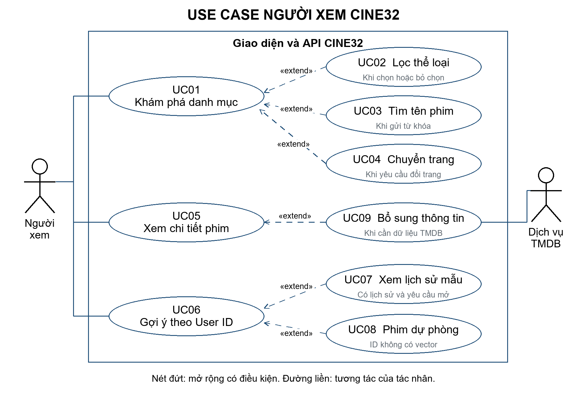
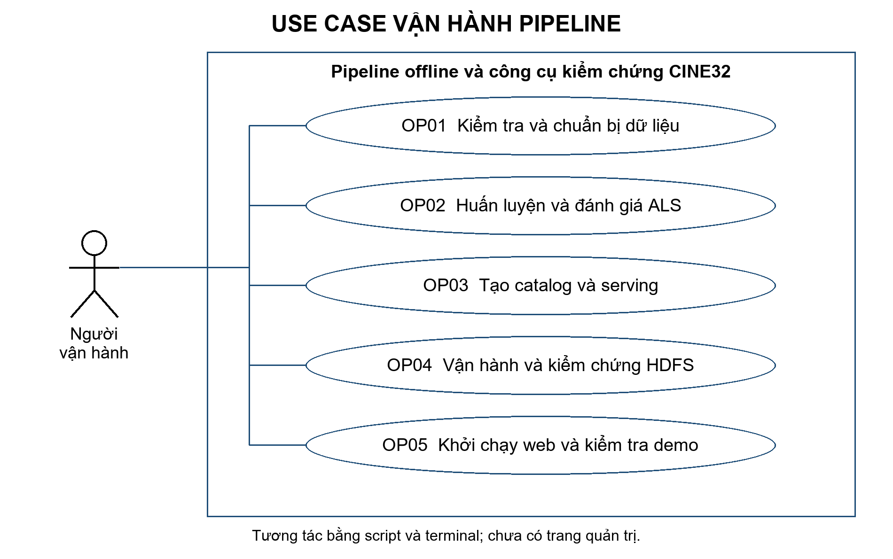
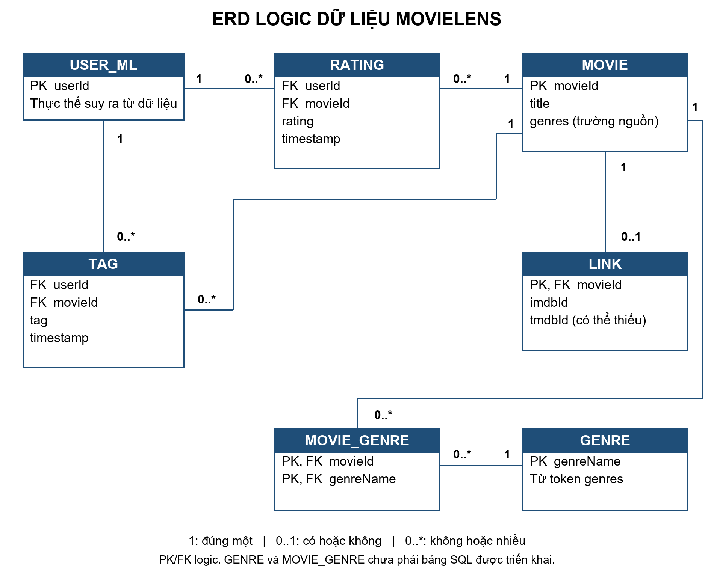
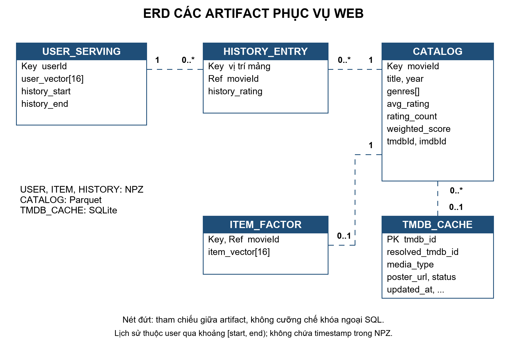

# Phân tích nghiệp vụ và sơ đồ CINE32

Tài liệu mô tả nghiệp vụ của sản phẩm MovieLens 32M đang triển khai trong dự án. Nội dung được tích hợp vào các mục 2.8–2.12 của báo cáo Word. Sơ đồ có bản PNG để chèn vào báo cáo và bản draw.io để chỉnh sửa tại `diagrams/CINE32_USECASE_ERD.drawio`.

### 2.8 Phân tích nghiệp vụ

**Bài toán nghiệp vụ.** Người xem cần tìm được phim phù hợp trong danh mục lớn, có thông tin để cân nhắc lựa chọn và có gợi ý dựa trên lịch sử khi dữ liệu cho phép. CINE32 hỗ trợ khám phá toàn bộ danh mục theo thể loại, tìm tên phim, xem thông tin phim và minh họa gợi ý cá nhân bằng User ID MovieLens. Giá trị của hệ thống là giảm thao tác tìm kiếm và cung cấp căn cứ lựa chọn; chưa có khảo sát để định lượng mức hài lòng hay mức tăng tương tác của người xem.

**Phạm vi hiện tại.** Người xem sử dụng web mà không đăng nhập. User ID là mã ẩn danh trong bộ dữ liệu, được nhập để demo một hồ sơ sở thích đã có, không phải danh tính được xác thực của người đang mở web. Chưa có chức năng đăng ký, chấm điểm mới, lưu thể loại yêu thích, danh sách xem sau, mua vé hoặc phát phim. Các chức năng này không được đưa vào sơ đồ như chức năng đã triển khai.

**Tác nhân và trách nhiệm.** Tác nhân là người hoặc dịch vụ bên ngoài tương tác với hệ thống; React, FastAPI, Spark, ALS và HDFS là các thành phần bên trong phạm vi giải pháp, không phải tác nhân người dùng.

| Tác nhân | Mục tiêu | Cách tương tác hiện tại |
| --- | --- | --- |
| Người xem | Khám phá, xem chi tiết, xem gợi ý và lịch sử mẫu | Giao diện CINE32; không cần tài khoản |
| Người vận hành | Chuẩn bị dữ liệu, huấn luyện, đóng gói và kiểm chứng demo | Chạy script và lệnh trong terminal; chưa có trang quản trị |
| Dịch vụ TMDB | Cung cấp poster và thông tin bổ sung | API ngoài, tải nền và cache; không quyết định điểm MovieLens hay thứ hạng ALS |

**Đầu vào và đầu ra.** Luồng khám phá nhận tập thể loại, từ khóa và số trang, trả về danh sách phim phù hợp cùng tổng số kết quả. Luồng gợi ý nhận User ID, trả về tối đa 10 phim, chiến lược sử dụng và lịch sử mẫu nếu ID có trong model. Luồng vận hành nhận 4 CSV MovieLens và cấu hình, tạo Parquet, tập chia, model, catalog, vector serving và bảng minh chứng.

**Điểm tách biệt giữa hai nghiệp vụ.** Khám phá theo thể loại lọc toàn danh mục và xếp hạng bằng mức khớp thể loại cùng weighted score. Gợi ý ALS dùng lịch sử của User ID và tập phim đủ điều kiện. Bộ lọc thể loại trên màn hình khám phá hiện không lọc danh sách ALS; lựa chọn thể loại cũng không tự tạo vector cho người dùng mới.

### 2.9 Quy trình và quy tắc nghiệp vụ

**Quy trình khám phá phim.** Người xem mở danh mục, chọn hoặc bỏ chọn thể loại; hệ thống tự tải lại kết quả từ trang 1. Nếu cần thu hẹp kết quả, người xem nhập tên phim và gửi tìm kiếm. Danh sách được phân trang để người xem duyệt mọi phim khớp; nhấn vào thẻ phim sẽ mở hộp chi tiết. Poster có thể được bổ sung sau khi tên và điểm phim đã hiển thị.

**Quy trình gợi ý theo User ID.** Người xem nhập ID và chọn Xem Top 10 hoặc chọn ID mẫu. Hệ thống kiểm tra đầu vào và tra vector. Nếu có vector, hệ thống chấm tập ứng viên, loại phim đã đánh giá, sắp xếp và trả tối đa 10 phim. Nếu không có vector, hệ thống trả danh sách dự phòng theo weighted score và thông báo không có lịch sử trong model. Người xem có thể mở lịch sử mẫu và chi tiết các phim nhận được.

**Quy trình vận hành.** Người vận hành kiểm tra dữ liệu, chuyển Parquet, khảo sát, chia tập, train/tuning và đánh giá; sau đó tạo catalog và đóng gói serving. Demo HDFS thực hiện ETL và suy luận bằng model đã có, đối chiếu số dòng và Top 10. Web đọc artifact đã chuẩn bị; không train lại mỗi lần nhận yêu cầu. Train và benchmark local được phân biệt với lần kiểm chứng HDFS bổ sung.

| Mã | Quy tắc nghiệp vụ | Ý nghĩa đối với người sử dụng |
| --- | --- | --- |
| BR01 | Chọn nhiều thể loại theo phép HOẶC | Phim khớp ít nhất một thể loại được giữ; ưu tiên phim khớp nhiều thể loại |
| BR02 | Không chọn thể loại thì duyệt toàn catalog | Phim chưa có thể loại vẫn có thể xuất hiện trong danh mục chung |
| BR03 | Khám phá trả mọi phim khớp, 24 phim mỗi trang | Không có lựa chọn giới hạn số phim hay nút gợi ý cho bộ lọc thể loại |
| BR04 | Đổi thể loại hoặc gửi tìm kiếm đưa về trang 1 | Từ khóa tìm kiếm được kết hợp với bộ lọc hiện tại; tìm theo tên, không phân biệt hoa thường |
| BR05 | Xếp khám phá theo số thể loại khớp, weighted score, lượt chấm, movieId | Ba tiêu chí đầu giảm dần; movieId tăng dần để phá hòa. Khi không lọc, bỏ tiêu chí số thể loại khớp |
| BR06 | Điểm cộng đồng lấy từ train + validation MovieLens | Phim chưa được chấm hiển thị chưa có đánh giá; không gán 0 sao hay dùng điểm IMDb |
| BR07 | ALS dùng phim có vector và ít nhất 100 lượt chấm trong catalog | Demo hiện có 11.330 ứng viên; điều kiện này không loại phim khỏi danh mục khám phá |
| BR08 | Gợi ý ALS loại toàn bộ phim ID đã chấm trong dataset | Lịch sử serving gồm train, validation và test; protocol metric offline được trình bày riêng |
| BR09 | ALS sắp điểm giảm dần, movieId tăng dần; trả tối đa 10 phim | Chỉ giữ điểm hữu hạn; có thể trả ít hơn 10 nếu không còn đủ ứng viên |
| BR10 | ID không có vector dùng weighted score trên tập ứng viên serving | Không hiển thị điểm ALS cho kết quả dự phòng; không giả định đã cá nhân hóa |
| BR11 | Điểm ALS và điểm cộng đồng là hai đại lượng khác nhau | ALS có thể vượt 5; không trình bày như sao cộng đồng trong khoảng 0,5–5 |
| BR12 | Thiếu ảnh, token hoặc lỗi TMDB dùng ảnh thay thế | Danh sách và điểm MovieLens vẫn có thể được xem; thông tin ngoài có thể chưa sẵn sàng |

ID hợp lệ là số nguyên từ 0 đến 2.147.483.647. API trả 422 khi tham số vi phạm giới hạn; ID hợp lệ nhưng không có trong vector là trường hợp dự phòng, không phải lỗi. Thiếu catalog hoặc artifact ALS trả 503 ở API tương ứng. Trang vượt số trang được đưa về trang cuối; danh sách rỗng trả page=1 và totalPages=0.

### 2.10 Sơ đồ Use Case

**Phạm vi giao diện.** Hình 2.2 đặt Người xem và TMDB ngoài biên CINE32. Các đường nối không có mũi tên là quan hệ tương tác, không biểu diễn thứ tự thực hiện. Các trường hợp tải ảnh bên ngoài có điều kiện và có phương án thay thế.

UC02, UC03 và UC04 mở rộng UC01 khi người xem thao tác với bộ lọc, gửi tìm kiếm hoặc đổi trang. UC08 mở rộng UC06 khi ID không có vector; UC07 mở rộng UC06 khi có lịch sử và người xem yêu cầu mở lịch sử. UC09 mở rộng UC05 khi thông tin TMDB cần bổ sung. Poster trên danh sách cũng được nạp nền qua cùng dịch vụ; sơ đồ không ngụ ý phải mở chi tiết mới có poster.

Quan hệ extend có mũi tên nét đứt từ use case mở rộng đến use case gốc và ghi điều kiện. Đây là hành vi tùy điều kiện, không phải thao tác bắt buộc. Không dùng include giữa khám phá và gợi ý ALS vì hai chức năng có thể được dùng độc lập. Các bước chấm điểm và loại phim đã xem được mô tả trong UC06, không biến mọi bước xử lý nội bộ thành mục tiêu riêng của người xem.

**Phạm vi vận hành.** Hình 2.3 mô tả người vận hành chạy pipeline bằng terminal. Các nhóm công việc không được vẽ thành include liên hoàn vì chúng có thể chạy riêng và tái sử dụng artifact đã tồn tại; sơ đồ Use Case không thay thế thứ tự pipeline ở mục 2.7.

| Mã | Use Case | Bằng chứng triển khai |
| --- | --- | --- |
| UC01–UC04 | Khám phá, lọc, tìm và chuyển trang | App.tsx; GET /api/movies; genre_recommender.py |
| UC05, UC09 | Xem chi tiết và bổ sung thông tin phim | MovieModal; GET /api/posters; poster_loader.py; poster_cache.py |
| UC06–UC08 | Gợi ý theo ID, lịch sử và danh sách dự phòng | PersonalRecommendations.tsx; GET /api/als/recommendations; als_recommender.py |
| OP01 | Kiểm tra và chuẩn bị dữ liệu | scripts/00–03 |
| OP02 | Huấn luyện và đánh giá ALS | scripts/04–05, 09–10 |
| OP03 | Tạo catalog và đóng gói serving | scripts/06–08, 12 |
| OP04 | Vận hành và kiểm chứng HDFS | scripts/11, 13 |
| OP05 | Khởi chạy web và kiểm tra demo | Uvicorn; frontend build; tests; JSON đối soát |

### 2.11 Đặc tả Use Case

#### UC01 Khám phá danh mục

Tác nhân: Người xem. Kích hoạt: mở mục Khám phá. Tiền điều kiện: catalog sẵn sàng. Luồng chính: hệ thống đọc danh mục, xếp theo weighted score và lượt chấm, trả trang đầu cùng tổng số phim; giao diện hiện tên, thể loại, điểm và trạng thái ảnh. Hậu điều kiện: người xem có danh sách để duyệt; không ghi dữ liệu sở thích. Ngoại lệ: thiếu catalog thì báo không tải được và cho thử lại; chưa có ảnh thì dùng placeholder.

#### UC02 Lọc thể loại

Tác nhân: Người xem. Kích hoạt: chọn hoặc bỏ chọn chip thể loại trong UC01. Luồng chính: cập nhật tập thể loại, đặt trang 1, lọc phim khớp ít nhất một thể loại, xếp theo BR05 và hiển thị kết quả; giữ từ khóa đang áp dụng. Chọn Tất cả phim xóa tập thể loại. Hậu điều kiện: mọi phim khớp có thể được duyệt qua phân trang. Ngoại lệ: không có kết quả thì hiện thông báo; API từ chối thể loại không hợp lệ bằng 422.

#### UC03 Tìm tên phim

Tác nhân: Người xem. Kích hoạt: gửi biểu mẫu tìm kiếm hoặc nhấn Enter. Luồng chính: bỏ khoảng trắng hai đầu từ khóa, đặt trang 1, tìm chuỗi trong tên gốc hoặc tên hiển thị rồi kết hợp bộ lọc thể loại hiện tại. Hậu điều kiện: danh sách phản ánh từ khóa đã gửi. Ngoại lệ: không có kết quả thì gợi ý đổi từ khóa; xóa tìm kiếm bỏ điều kiện tên. API giới hạn từ khóa 100 ký tự; giao diện hiện gửi biểu mẫu, không tự tìm sau từng ký tự.

#### UC04 Chuyển trang

Tác nhân: Người xem. Tiền điều kiện: đã có danh sách kết quả. Kích hoạt: chọn trang trước, trang sau hoặc nhập số trang. Luồng chính: yêu cầu trang trong cùng tập thể loại và từ khóa, nhận tối đa 24 phim và cập nhật danh sách. Hậu điều kiện: người xem tiếp tục duyệt tập kết quả. Ngoại lệ: trang quá lớn được API đưa về trang cuối; khi không có kết quả, giao diện không cung cấp chuyển trang hữu ích.

#### UC05 Xem chi tiết phim

Tác nhân: Người xem. Kích hoạt: nhấn thẻ phim hoặc một phim trong lịch sử. Luồng chính: mở hộp chi tiết từ dữ liệu phim đã nhận; hiện tên, thể loại, poster, điểm cộng đồng và mô tả nếu có. Điểm ALS hiện riêng khi mở phim từ gợi ý; điểm từng chấm nằm ở danh sách lịch sử. Người xem đóng hộp để trở lại danh sách. Ngoại lệ: thiếu mô tả hay poster thì thông báo hoặc dùng ảnh thay thế; chưa có lượt chấm thì hiện chưa có đánh giá.

#### UC06 Xem gợi ý theo User ID

Tác nhân: Người xem. Tiền điều kiện: catalog và artifact ALS sẵn sàng. Kích hoạt: gửi ID, chọn ID mẫu hoặc mở mục gợi ý với ID mặc định. Luồng chính: kiểm tra ID; nếu có vector, chấm tập ứng viên bằng tích vô hướng, loại các phim trong lịch sử, sắp thứ hạng theo BR09; trả phim, điểm ALS và lịch sử mẫu. Hậu điều kiện: tối đa 10 phim chưa được ID đánh giá. Ngoại lệ: ID không có vector đi UC08; sai đầu vào trả 422, thiếu artifact trả 503; hết ứng viên trả danh sách rỗng.

#### UC07 Xem lịch sử mẫu

Tác nhân: Người xem. Tiền điều kiện: UC06 đã trả lịch sử của một ID có vector. Kích hoạt: mở khối Lịch sử đã đánh giá. Luồng chính: hiện tối đa 12 phim gần nhất có trong catalog theo dữ liệu serving, kèm điểm mà ID từng chấm; có thể nhấn để mở UC05. Hậu điều kiện: người xem hiểu lịch sử dùng để loại phim đã chấm. Ngoại lệ: ID mới không có lịch sử thì không hiện khối này. Đây là lịch sử MovieLens, không phải nhật ký truy cập web.

#### UC08 Xem phim dự phòng

Tác nhân: Người xem. Điều kiện mở rộng UC06: ID hợp lệ nhưng không có vector. Luồng chính: chọn tối đa 10 phim theo weighted score, lượt chấm và movieId trong tập ứng viên serving; hiện thông báo chưa có lịch sử và không có điểm ALS. Hậu điều kiện: người mới vẫn có danh sách tham khảo. Không train mới hoặc suy ra sở thích từ ID; không gán phim dự phòng thành gợi ý đã cá nhân hóa.

#### UC09 Bổ sung thông tin phim

Tác nhân chính: Người xem qua thao tác UC05; tác nhân hỗ trợ: TMDB. Điều kiện mở rộng: cần thông tin ngoài chưa có sẵn. Luồng chính: backend đọc cache còn hạn, đưa tra cứu thiếu vào hàng đợi nền, gọi TMDB nếu có cấu hình, lưu kết quả phù hợp rồi cập nhật thông tin trên giao diện. Ngoại lệ: thiếu tmdbId/token, không tìm thấy hoặc lỗi mạng thì giữ dữ liệu MovieLens và placeholder. Việc làm giàu ảnh cũng chạy khi tải danh sách; không ghi đè rating bằng vote_average của TMDB.

#### OP01 Chuẩn bị dữ liệu

Tác nhân: Người vận hành. Tiền điều kiện: 4 CSV và môi trường đã chuẩn bị. Luồng chính: kiểm tra checksum và schema, chuyển Parquet, tạo EDA, chia lịch sử theo thời gian từng user. Hậu điều kiện: có dữ liệu xử lý và số liệu kiểm tra. Ngoại lệ: thiếu tệp hoặc dữ liệu không đạt yêu cầu thì xử lý trước khi train; không công bố số liệu từ đầu ra chưa được đối soát.

#### OP02 Huấn luyện và đánh giá

Tác nhân: Người vận hành. Tiền điều kiện: tập chia và Spark sẵn sàng. Luồng chính: chạy baseline và ALS, tuning trên validation, fit cấu hình cuối trên train + validation, chấm test và lưu model/metric; phân tích ranking và benchmark riêng. Hậu điều kiện: có model truy vết được tới cấu hình. Ngoại lệ: thiếu tài nguyên hoặc job lỗi thì không coi là train thành công; kết quả sau phân tích ngưỡng trên test cần holdout mới để xác nhận.

#### OP03 Đóng gói phục vụ

Tác nhân: Người vận hành. Tiền điều kiện: model, lịch sử và metadata đã có. Luồng chính: tổng hợp catalog, giữ liên kết ngoài, xuất vector user/phim và chỉ mục lịch sử cùng manifest. Hậu điều kiện: backend có artifact để suy luận bằng NumPy. Ngoại lệ: vector không hữu hạn hoặc số chiều không khớp thì dừng đóng gói; thiếu model không được thay bằng kết quả giả.

#### OP04 Vận hành và kiểm chứng HDFS

Tác nhân: Người vận hành. Tiền điều kiện: Hadoop, 4 CSV và vector model sẵn sàng. Luồng chính: khởi động NameNode/DataNode, nạp CSV lên HDFS, dùng Spark đọc và ghi Parquet, đối soát số dòng, suy luận Top 10 từ vector và lưu JSON kiểm chứng. Hậu điều kiện: có bằng chứng đọc/ghi và suy luận trên HDFS. Ngoại lệ: thiếu DataNode hoặc không đọc được đường dẫn HDFS thì lần kiểm chứng chưa đạt; không thay số liệu bằng kết quả local. Không train lại trong use case này.

#### OP05 Khởi chạy web và kiểm tra demo

Tác nhân: Người vận hành. Tiền điều kiện: frontend đã build, catalog và serving đã có. Luồng chính: khởi chạy FastAPI, mở CINE32, kiểm tra khám phá, User ID có vector, ID mới, lịch sử, chi tiết và hai kích thước màn hình; chạy kiểm thử và đối chiếu JSON. Hậu điều kiện: xác nhận phạm vi demo trên máy đã kiểm tra. Ngoại lệ: thiếu artifact hoặc lỗi dịch vụ thì khắc phục và kiểm tra lại; chưa thử trên máy khác không được ghi nhận là đã nghiệm thu trên máy khác.

### 2.12 Sơ đồ ERD và thiết kế dữ liệu

**ERD nghiệp vụ.** Hình 2.4 mô tả quan hệ logic của MovieLens. USER_ML là thực thể suy ra từ mã user trong ratings/tags, không phải bảng tài khoản có tên, email hoặc mật khẩu. GENRE và MOVIE_GENRE thể hiện phép chuẩn hóa thể loại để giải thích quan hệ nhiều–nhiều; triển khai thực tế lưu genres dạng chuỗi CSV hoặc mảng trong catalog, chưa có hai bảng SQL này.

Mỗi RATING gắn một user và một phim; một user hoặc phim có nhiều lượt đánh giá. TAG là một sự kiện gắn nhãn bởi một user cho một phim; nhiều nhãn có thể xuất hiện cho cùng cặp user–phim. LINK nối movieId với định danh IMDb/TMDB. Một phim có nhiều thể loại và một thể loại chứa nhiều phim, được biểu diễn qua MOVIE_GENRE.

Ký hiệu 1 là đúng một, 0..1 là có hoặc không một bản ghi, 0..* là không hoặc nhiều bản ghi. PK/FK trong sơ đồ là khóa định danh và tham chiếu logic; CSV/Parquet không tự cưỡng chế khóa ngoại. RATING và TAG không có cột ratingId/tagId trong nguồn. Báo cáo không tự nhận cặp userId–movieId là khóa chính duy nhất; nếu xây cơ sở dữ liệu giao dịch sau này phải kiểm tra tính duy nhất hoặc bổ sung khóa sự kiện.

| Thực thể | Thuộc tính và định danh | Cách lưu hiện tại |
| --- | --- | --- |
| USER_ML | userId là khóa logic; không có hồ sơ cá nhân | Suy ra từ ratings/tags; user_ids trong serving |
| MOVIE | movieId, title, genres | movies.csv/Parquet; movieId dùng nối các bảng |
| RATING | userId, movieId, rating, timestamp | ratings.csv/Parquet; rating 0,5–5,0, timestamp Unix |
| TAG | userId, movieId, tag, timestamp | tags.csv/Parquet; không tham gia model ALS hiện tại |
| LINK | movieId, imdbId, tmdbId | links.csv/Parquet; imdbId giữ chuỗi, tmdbId có thể thiếu |
| GENRE | genreName là khóa logic | Token trong trường genres; nhãn tiếng Việt được ánh xạ trong mã |
| MOVIE_GENRE | movieId + genreName là khóa ghép logic | Quan hệ suy ra từ genres; không phải bảng SQL đã tạo |

**ERD dữ liệu phục vụ web.** Hình 2.5 mô tả dữ liệu sau xử lý. Các liên kết nét đứt là tham chiếu giữa artifact, không phải FOREIGN KEY trong cùng một cơ sở dữ liệu. CATALOG kết hợp metadata với thống kê từ train + validation. Vector phim chỉ có ở phim được model học; không phải mọi phim trong catalog đều có vector hoặc đủ ngưỡng serving.

USER_SERVING chứa mã user, vector và khoảng chỉ mục [start, end) trong lịch sử. HISTORY_ENTRY là bản ghi logic theo vị trí trong các mảng movie/rating; user được xác định qua khoảng chỉ mục, không có cột userId riêng trong từng entry NPZ. Timestamp được dùng để sắp trước khi xuất và không nằm trong mảng lịch sử serving. Lịch sử này không cập nhật khi người xem chỉ mở phim trên web.

| Artifact | Trường dữ liệu | Nguồn và vai trò |
| --- | --- | --- |
| Catalog Parquet | movieId, title, year, genres, avg_rating, rating_count, weighted_score, tmdbId, imdbId | Metadata và thống kê rating; duyệt phim và kết nối thông tin ngoài |
| User serving NPZ | user_ids, user_factors, history_starts, history_ends | Vector model và khoảng chỉ mục lịch sử theo user |
| Item serving NPZ | item_ids, item_factors | Vector phim; backend lọc tiếp theo rating_count >= 100 |
| History serving NPZ | history_movie_ids, history_ratings | Lịch sử toàn dataset, dùng loại phim đã chấm và hiện lịch sử mẫu |
| TMDB SQLite | tmdb_id là PK; resolved_tmdb_id, media_type, lookup_imdb_id, title, title_vi, overview, overview_lang, poster_path, poster_url, backdrop_url, release_date, vote_average, status, updated_at | Bảng tmdb_movies lưu thông tin ngoài, mặc định TTL 7 ngày |
| Manifest JSON | Nguồn artifact, tham số, số lượng, chính sách lịch sử và metric | Metadata kiểm toán; không phải bảng quan hệ giao dịch |

tmdb_id trong cache là ID dùng để tra cứu từ liên kết MovieLens; resolved_tmdb_id và media_type ghi đích được tìm thấy khi phải tra cứu qua IMDb hoặc gặp nội dung TV. Không coi tmdbId của catalog là duy nhất giữa các phim. Cache chỉ lưu các trạng thái ok/not_found; lỗi tạm thời không được lưu như kết quả cố định. vote_average của TMDB tồn tại trong cache nhưng điểm cộng đồng trên web lấy avg_rating từ catalog MovieLens.

**Ràng buộc và tính nhất quán.** Khi tạo artifact, movieId và userId phải nối đúng nguồn; vector user/phim phải hữu hạn và cùng số chiều; các khoảng lịch sử phải nằm trong chiều dài mảng. Phim chưa có rating vẫn được giữ qua left join, với rating_count=0 và avg_rating thiếu. Tập thể loại người xem chọn và danh sách gợi ý được xử lý theo yêu cầu; chưa có bảng lưu sở thích, phiên đăng nhập hay kết quả gợi ý của từng khách hàng.

**Nguồn đối chiếu.** Nội dung được kiểm tra với web_api.py, frontend/src/App.tsx, frontend/src/PersonalRecommendations.tsx, src/recommender/genre_recommender.py, als_recommender.py, poster_cache.py và scripts/07_build_movie_catalog.py, scripts/12_prepare_als_serving.py. Sơ đồ là tài liệu của phạm vi đã triển khai, không phải cam kết về các chức năng tương lai.
